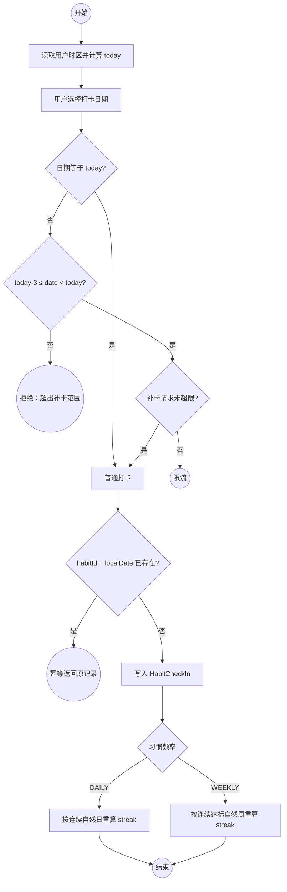
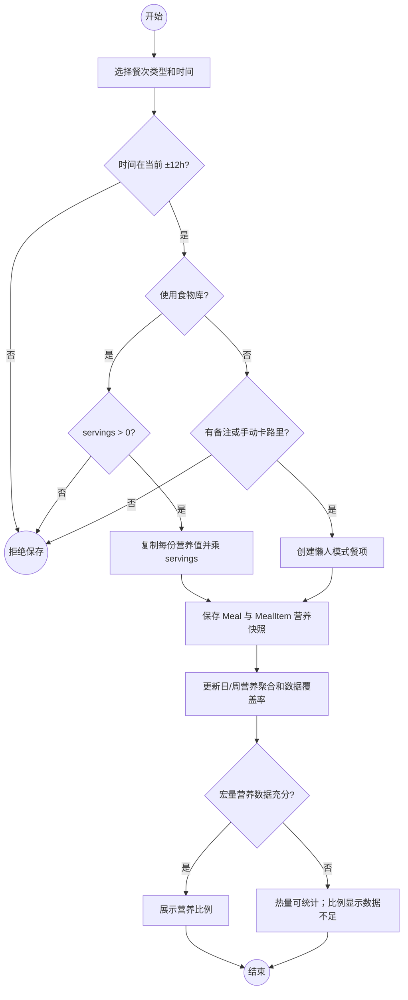
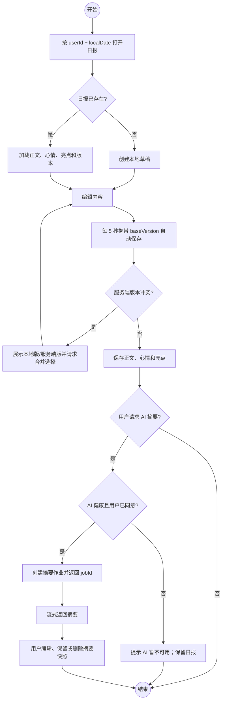
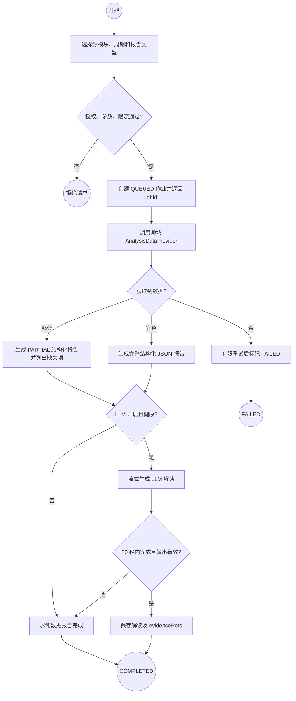
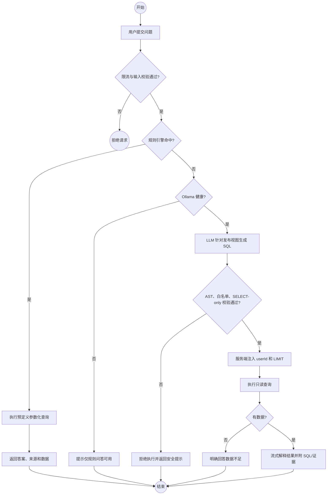
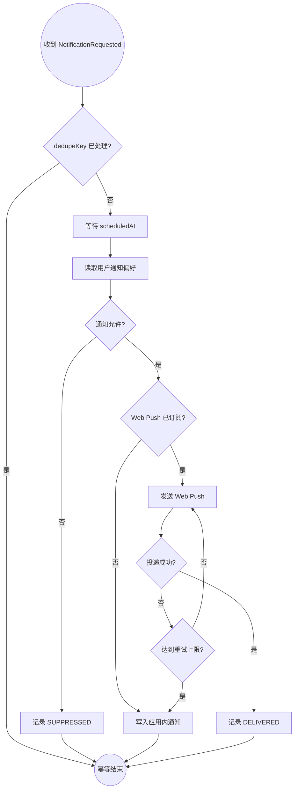

# Lifewise 业务架构设计

> **文档状态**：Approved Design（设计契约，非实现状态）  
> **文档版本**：v1.0  
> **设计日期**：2026-07-25  
> **覆盖范围**：v1.0 MVP 正式架构，并明确 v1.1+ 演进边界  
> **目标读者**：产品、研发、测试与架构评审人员  
> **架构方法**：领域模块化 + 稳定接口 + 事件协作

---

## 1. 文档目的与范围

本文档基于以下 PRD，定义 Lifewise 的业务实体、模块边界、依赖方向、接口契约、核心流程、异常策略和演进约束：

- [`01-task-management.md`](../specs/PRD/01-task-management.md)
- [`02-daily-report.md`](../specs/PRD/02-daily-report.md)
- [`03-expense-tracking.md`](../specs/PRD/03-expense-tracking.md)
- [`04-diet-tracking.md`](../specs/PRD/04-diet-tracking.md)
- [`05-plan-management.md`](../specs/PRD/05-plan-management.md)
- [`06-ai-analysis.md`](../specs/PRD/06-ai-analysis.md)

### 1.1 架构目标

1. 使任务、计划、日报、消费、饮食和 AI 能力保持高内聚、低耦合。
2. 明确每类业务数据的唯一所有者，禁止跨模块直接修改数据。
3. 将即时交互与最终一致性流程分离，避免跨模块分布式事务。
4. 保证 Ollama、Web Push、统计投影或导出能力故障时，核心记录仍可正常保存。
5. 为 v1.1+ 的跨模块洞察和自动报告保留演进接口，但不提前建设完整数据中枢或微服务体系。

### 1.2 MVP 范围

MVP 包含：

- 任务、子任务、标签、习惯、打卡和 streak。
- 计划、里程碑、任务关联和进度同步。
- 日报、心情、亮点、时间线、搜索和手动 AI 摘要。
- 消费、分类、预算、统计和预算提醒。
- 餐次、食物库、营养快照和日/周营养统计。
- 单模块 AI 报告、规则优先问答、受限 SQL 问答和 AI 健康状态。
- Web Push、应用内通知降级和 PRD 明确要求的数据导出。

MVP 不包含跨模块 AI 洞察、自动周/月报、多模态识别、共享协作、AI 执行业务操作和完整生活事件账本。

### 1.3 图例

本文使用 Mermaid `flowchart` 表达 BPMN 类似语义：

| 符号 | Mermaid 表达 | 含义 |
|---|---|---|
| 开始/结束事件 | `((事件))` | 流程触发或终止 |
| 活动 | `[活动]` | 用户任务、服务任务或业务操作 |
| 决策网关 | `{条件?}` | 排他决策或分支 |
| 实线箭头 | `-->` | 同步控制流/调用 |
| 虚线箭头 | `-.->` | 异步事件或最终一致性传播 |
| 子图 | `subgraph` | 模块或参与者泳道 |

---

## 2. 架构原则

### 2.1 核心原则

1. **单一数据所有者**：每个聚合只能由所属业务域修改。
2. **契约优先**：跨域仅传稳定标识、业务事实、只读快照和证据引用。
3. **单域强一致**：用户命令在单一业务域内通过本地事务提交。
4. **跨域最终一致**：跨域联动通过事务性 Outbox 和异步事件完成。
5. **依赖单向化**：消费者依赖发布方的稳定接口，发布方不依赖消费者实现。
6. **原始记录优先**：AI、通知、导出和统计失败不得回滚已保存的原始业务数据。
7. **AI 只读可追溯**：AI 不直接修改源域，所有回答和报告必须可追溯到数据来源。
8. **模块化单体优先**：MVP 使用模块化单体；只有独立扩缩容或团队边界被证明后才拆分服务。

### 2.2 数据所有权规则

- 每条用户数据必须携带 `userId`，所有读取和引用均校验所有权。
- 各模块不共享可写 ORM 实体、Repository 或内部数据表。
- 跨域引用只保存稳定 ID；展示需要的字段通过引用查询接口或本地只读投影获得。
- AI 只访问版本化分析视图或 `AnalysisDataProvider`，不得读取任意内部表。
- 导出模块只负责任务生命周期、分页读取、格式化和产物管理；字段业务语义仍由源域负责。

---

## 3. 核心业务实体

### 3.1 实体关系图

```mermaid
erDiagram
    USER ||--|| USER_PREFERENCE : owns
    USER ||--o{ TASK : owns
    TASK ||--o{ TASK_LABEL : tagged_by
    TASK ||--o{ TASK : parent_of
    USER ||--o{ HABIT : owns
    HABIT ||--o{ HABIT_CHECK_IN : records

    USER ||--o{ PLAN : owns
    PLAN ||--o{ MILESTONE : contains
    TASK ||--o{ TASK_MILESTONE_LINK : referenced_by
    MILESTONE ||--o{ TASK_MILESTONE_LINK : links

    USER ||--o{ DAILY_REPORT : owns
    DAILY_REPORT ||--o{ HIGHLIGHT : contains
    DAILY_REPORT ||--o| SUMMARY_SNAPSHOT : has

    USER ||--o{ EXPENSE : owns
    USER ||--o{ EXPENSE_CATEGORY : configures
    USER ||--o{ PAYMENT_METHOD : configures
    EXPENSE_CATEGORY ||--o{ EXPENSE : classifies
    PAYMENT_METHOD ||--o{ EXPENSE : pays
    USER ||--o{ BUDGET : configures
    EXPENSE_CATEGORY o|--o{ BUDGET : scopes

    USER ||--o{ MEAL : owns
    MEAL ||--o{ MEAL_ITEM : contains
    FOOD o|--o{ MEAL_ITEM : referenced_by
    USER ||--o{ FOOD : customizes
    USER ||--o| NUTRITION_TARGET : configures

    USER ||--o{ ANALYSIS_JOB : requests
    ANALYSIS_JOB ||--o| AI_REPORT : produces
    AI_REPORT ||--o{ EVIDENCE : cites
    USER ||--o{ CONVERSATION : owns
    CONVERSATION ||--o{ CHAT_MESSAGE : contains
    AI_REPORT ||--o{ AI_FEEDBACK : receives

    USER ||--o{ NOTIFICATION_REQUEST : receives
    NOTIFICATION_REQUEST ||--o{ NOTIFICATION_DELIVERY : attempts
    USER ||--o{ EXPORT_REQUEST : requests
    EXPORT_REQUEST ||--o| EXPORT_ARTIFACT : produces
```



### 3.2 实体目录

| 业务域 | 核心实体 | 关键不变量 |
|---|---|---|
| 用户与偏好 | `User`、`UserPreference`、`UserProfile` | 时区必须有效；AI/通知同意状态可撤回；敏感画像按最小权限暴露 |
| 任务与习惯 | `Task`、`TaskLabel`、`Habit`、`HabitCheckIn` | 子任务最多一层；每任务最多 5 个标签；`habitId + localDate` 唯一 |
| 计划 | `Plan`、`Milestone`、`TaskMilestoneLink` | 计划拥有里程碑；跨域链接必须同一用户；已完成里程碑不因任务重开而回退 |
| 日报 | `DailyReport`、`Highlight`、`SummarySnapshot` | `userId + localDate` 唯一；亮点最多 3 条；摘要快照可编辑或删除 |
| 消费与预算 | `Expense`、`ExpenseCategory`、`PaymentMethod`、`Budget` | 金额以整数 cents 保存；自定义分类与支付方式均不跨用户；MVP 固定 4 种支付方式（现金/支付宝/微信/银行卡），用户可启用/停用但不增删种类；预算按用户本地月份归属 |
| 饮食与营养 | `Meal`、`MealItem`、`Food`、`NutritionTarget` | `MealItem` 保存营养快照；servings 必须为正；历史不随食物库修改漂移 |
| AI 洞察 | `AnalysisJob`、`AIReport`、`Conversation`、`Evidence`、`AIFeedback` | 报告必须属于请求用户；结论关联证据；AI 不能直接修改源域 |
| 通知与提醒 | `NotificationRequest`、`NotificationDelivery` | `dedupeKey` 唯一控制重复；渠道失败不影响源业务事务 |
| 导出与数据携带 | `ExportRequest`、`ExportArtifact` | 产物只能由所属用户下载；产物有过期时间；事件中不携带文件正文 |

---

## 4. 业务模块

### 4.1 模块列表

| 模块 | 职责范围 | 拥有的业务数据 | 明确边界/不负责事项 |
|---|---|---|---|
| **用户与偏好** | 提供用户身份引用、时区、语言、AI 同意、通知偏好和营养估算所需基础画像 | 用户偏好、时区、同意状态、基础画像 | 不拥有任务、日报等领域数据；不负责渠道投递 |
| **任务与习惯** | 管理任务生命周期、子任务、标签、习惯频率、打卡和 streak | 任务、标签、习惯、打卡记录 | 不计算计划进度；不发送 Push；不生成 AI 报告 |
| **计划** | 管理长期计划、里程碑、进度、任务关联、截止状态 | 计划、里程碑、任务链接 | 不修改任务状态；不读取任务内部表；不直接发送通知 |
| **日报** | 管理每日唯一记录、心情、亮点、时间线、搜索和用户采纳的摘要快照 | 日报、亮点、摘要快照 | 不执行 LLM；不拥有任务、消费或饮食原始数据 |
| **消费与预算** | 管理消费、分类、预算、月度聚合和阈值判断 | 消费、分类、预算、预算阈值状态 | 不负责 Push 投递；不把统计相关性解释为 AI 结论；月度/分类聚合采用按月预计算 + Redis 缓存，超阈值查归档视图（与 §11 一致） |
| **饮食与营养** | 管理餐次、食物库、营养快照、摄入目标和日/周聚合 | 餐次、餐项、食物、营养目标 | 不提供医疗诊断；MVP 不负责图片/语音识别 |
| **AI 洞察** | 管理分析作业、结构化报告、LLM 解读、规则/SQL 问答、证据和反馈 | 作业、报告、会话、证据、反馈 | 不直接写源业务域；MVP 不执行删除、修改等操作 |
| **通知与提醒** | 管理通知偏好读取、调度、模板、去重、渠道投递、重试和应用内降级 | 通知请求、投递尝试、投递结果 | 不决定业务上“为何/何时提醒”；不回写源聚合 |
| **导出与数据携带** | 管理导出请求、分页读取、文件生成、打包、下载授权和过期清理 | 导出请求、产物元数据 | 不定义源字段语义；不持久复制长期业务数据 |

### 4.2 模块依赖关系图

```mermaid
flowchart LR
    UI[应用交互层]

    subgraph SHARED[共享业务能力]
        USER[用户与偏好]
        NOTIFY[通知与提醒]
        EXPORT[导出与数据携带]
    end

    subgraph SOURCE[源业务域]
        TASK[任务与习惯]
        PLAN[计划]
        DAILY[日报]
        EXPENSE[消费与预算]
        MEAL[饮食与营养]
    end

    AI[AI 洞察]
    EVENT[(集成事件流)]

    UI --> TASK
    UI --> PLAN
    UI --> DAILY
    UI --> EXPENSE
    UI --> MEAL
    UI --> AI
    UI --> EXPORT

    TASK -->|GetUserContext| USER
    PLAN -->|GetUserContext| USER
    DAILY -->|GetUserContext| USER
    EXPENSE -->|GetUserContext| USER
    MEAL -->|GetUserContext| USER
    AI -->|GetUserContext| USER
    NOTIFY -->|GetUserContext| USER

    PLAN -->|Search/ValidateTaskReference| TASK
    TASK -. TaskCompleted.v1 .-> EVENT
    EVENT -.-> PLAN

    TASK -. NotificationRequested.v1 .-> EVENT
    PLAN -. NotificationRequested.v1 .-> EVENT
    EXPENSE -. NotificationRequested.v1 .-> EVENT
    EVENT -.-> NOTIFY

    AI -->|AnalysisDataProvider| TASK
    AI -->|AnalysisDataProvider| PLAN
    AI -->|AnalysisDataProvider| DAILY
    AI -->|AnalysisDataProvider| EXPENSE
    AI -->|AnalysisDataProvider| MEAL

    EXPORT -->|ExportDataProvider| DAILY
    EXPORT -->|ExportDataProvider| EXPENSE
    EXPORT -->|ExportDataProvider| MEAL
    EXPORT -->|ExportDataProvider| AI
```

### 4.3 依赖约束

- `计划 → 任务` 是 MVP 唯一直接跨源域同步依赖，只允许引用查询和所有权验证。
- `任务 → 计划` 通过 `TaskCompleted.v1` 异步传播完成事实，目标在 5 秒内可见。
- AI 和导出模块依赖源域发布的只读契约，不依赖源域 Repository 或数据库表。
- 通知模块只消费通知请求，不回调修改源业务状态。
- 集成事件流和应用交互层是技术/适配层，不拥有业务实体，不列为业务模块。

---

## 5. 模块接口定义

### 5.1 接口设计规则

- 表内接口名是逻辑契约，不绑定具体传输协议。
- 模块化单体内优先使用进程内 Application Port；浏览器入口使用 HTTP/SSE。
- 所有输入中的 `userId` 必须来自认证上下文，不信任客户端或 LLM 自报值。
- 查询接口必须分页或限制返回量；命令接口使用幂等键处理重试。
- **AI 限流**（对齐 PRD-06 §3 AI-043）：`/api/ai/reports`、`/api/ai/chat`、`/api/ai/reports/{jobId}/stream` 三类 AI 端点统一执行——每用户 10 req/min、60 req/h；全局 100 req/min；超限返回稳定错误码 `RATE_LIMITED` 并写入审计日志；连续超限主体自动熔断并告警。LLM 生成的 SQL 内部查询仍受底层数据库 `maxRows` / `LIMIT` 二次约束，与限流互补。
- 错误采用稳定错误码，用户界面只显示友好信息，详细上下文写入服务端日志。

### 5.2 同步接口

| 接口 | 提供方 | 调用方 | 输入 | 输出 | 调用方式 | 失败/一致性策略 |
|---|---|---|---|---|---|---|
| `GetUserContext` | 用户与偏好 | 所有业务域 | `userId`、所需字段集合 | `timeZone`、`locale`、`consent`、最小化 `profile` | 同步 Application Port | 不可用时禁止依赖时区/同意状态的写操作；不得猜测时区 |
| `SearchTaskReferences` | 任务与习惯 | 计划 | `userId`、`scope`、`query`、`page` | `taskId`、`title`、`status`、`dueAt` | 同步、分页 | 仅返回关联所需摘要；超时提示稍后重试 |
| `ValidateTaskReference` | 任务与习惯 | 计划 | `userId`、`taskId` | `exists`、`isOwned`、`status` | 同步 | 创建链接前强校验；失败时不创建链接 |
| `GetAnalysisSnapshot` | 五个源业务域 | AI 作业 | `userId`、`period`、`metricSet`、`cursor?` | `metrics`、`facts`、`evidenceRefs`、`schemaVersion` | 异步作业内同步调用 | 单源超时可生成 `PARTIAL` 报告；全部失败则作业失败 |
| `ExecuteSafeDataQuery` | 分析只读视图 | AI 问答 | `generatedSql`、服务端注入的 `userId`、`maxRows` | `columns`、`rows`、`evidenceRefs` | 同步受限查询 | AST + 白名单 + SELECT-only + LIMIT；校验失败禁止执行 |
| `CreateAnalysisJob` | AI 洞察 | 应用交互层 | `userId`、`sourceModule`、`period`、`reportType`、`llmEnabled`、`idempotencyKey` | `jobId`、`status=QUEUED` | HTTP 同步受理、后台异步执行 | 重复幂等键返回原作业；限流时返回稳定错误码 |
| `GetAnalysisJob` | AI 洞察 | 应用交互层 | `userId`、`jobId` | 作业状态、进度、错误摘要 | HTTP 查询 | 必须校验作业归属；不存在与越权使用不同内部日志、相同外部安全响应 |
| `StreamAnalysis` | AI 洞察 | 客户端 | `userId`、`jobId`、`lastEventId?` | SSE：`progress/data/token/completed/failed` | SSE | 断线可续传；作业完成后返回最终快照 |
| `GetExportDataset` | 日报/消费/饮食/AI | 导出作业 | `userId`、`period`、`filters`、`format`、`cursor?` | `schema`、`rows`、`nextCursor`、`fileNameHint` | 异步作业内同步分页 | 单批失败从游标重试；源域负责字段解释和脱敏 |
| `GetExportArtifact` | 导出与数据携带 | 客户端 | `userId`、`exportId` | 状态、下载引用、`expiresAt` | HTTP 查询/下载 | 校验归属和过期时间；不返回底层存储路径 |

### 5.3 异步事件信封

```json
{
  "eventId": "uuid",
  "eventType": "TaskCompleted",
  "eventVersion": 1,
  "occurredAt": "2026-07-25T10:00:00Z",
  "userId": "uuid",
  "aggregateId": "uuid",
  "correlationId": "uuid",
  "causationId": "uuid-or-null",
  "payload": {}
}
```

约束：

- `occurredAt` 使用 UTC ISO 8601；自然日语义另传 `localDate` 和 `timeZone`。
- 生产者在业务事务中同时写入 Outbox；发布失败不丢失业务事实。
- 消费者按 `eventId` 幂等，允许至少一次投递。
- 事件只包含消费方需要的最小事实，不包含完整聚合或导出文件。
- 事件新增字段必须向后兼容；破坏性变化发布新的 `eventVersion`。

### 5.4 异步事件目录

| 事件 | 发布方 → 消费方 | 核心载荷 | 业务结果 | 失败策略 |
|---|---|---|---|---|
| `TaskCompleted.v1` | 任务 → 计划 | `taskId`、`completedAt` | 命中链接时完成里程碑并重算计划进度 | 重试、幂等、死信；无链接正常结束 |
| `NotificationRequested.v1` | 任一源域 → 通知 | `templateCode`、`subjectRef`、`scheduledAt`、`deepLink`、`dedupeKey` | 按偏好调度并投递通知 | 按 dedupeKey 去重；Push 失败降级应用内通知 |
| `AnalysisCompleted.v1` | AI → 应用交互/通知 | `jobId`、`reportId`、`status`、`completedAt` | 结束 SSE，报告进入历史 | LLM 失败时允许结构化报告成功 |
| `ExportCompleted.v1` | 导出 → 应用交互/通知 | `exportId`、`status`、`artifactRef`、`expiresAt` | 提供限时下载入口 | 事件不携带文件；失败可重新执行导出作业 |
| `SourceDataChanged.v1` | 五个源域 → 分析投影（v1.1） | `sourceModule`、`aggregateId`、`changeType`、`occurredAt` | 增量更新跨模块分析读模型 | MVP 可仅发布/记录，不要求消费 |

---

## 6. 核心业务流程

### 6.1 流程 1：任务完成驱动里程碑进度

**描述**：用户完成任务后，任务域提交状态并发布完成事实；计划域异步完成关联里程碑并重算进度。

```mermaid
flowchart LR
    S((开始)) --> A[用户将任务标记为 DONE]
    subgraph TASK[任务与习惯域]
        A --> B{任务存在、归属正确且未完成?}
        B -- 否 --> X((幂等返回或拒绝))
        B -- 是 --> C[事务提交任务状态与 Outbox]
    end
    C -. TaskCompleted.v1 .-> D
    subgraph PLAN[计划域]
        D[按 eventId 幂等消费] --> E{存在有效任务链接?}
        E -- 否 --> N((正常结束))
        E -- 是 --> F{里程碑已 DONE?}
        F -- 是 --> N
        F -- 否 --> G[里程碑置 DONE]
        G --> H[重算计划完成进度]
    end
    H --> Z((结束))
```

**关键决策点**：

- 无链接不是异常，事件正常消费完成。
- 一个里程碑关联多个任务时，任一任务完成即将里程碑置为 `DONE`。
- 已完成里程碑不重复更新；任务重新打开不自动回退里程碑。

**异常处理**：

- 事件投递或消费失败：指数退避重试，超过上限进入死信队列。
- 计划或里程碑已删除：记录无效引用后忽略，不回滚任务。
- 最终一致性目标：任务完成后 5 秒内更新计划进度。

### 6.2 流程 2：习惯打卡、补卡与 streak 重算

**描述**：以用户时区自然日校验打卡日期，防止重复打卡，并按习惯频率重算当前和最长 streak。



**关键决策点**：

- 普通打卡只允许用户本地“今天”。
- 补卡允许最近 3 个已过去自然日：`today-3 ≤ date < today`。
- `DAILY` 按连续自然日计算；`WEEKLY` 按连续达到目标次数的自然周计算。

**异常处理**：

- 重复请求幂等返回，不重复累计。
- 同一习惯每天最多 5 次补卡请求，超过后限流。
- 时区变更后，历史打卡保留录入时的 `localDate` 和时区，不重写历史自然日。

### 6.3 流程 3：消费记录与预算阈值提醒

**描述**：保存消费后重算月度预算执行率；首次跨越 80% 或 100% 时异步请求通知。

```mermaid
flowchart LR
    S((开始)) --> A[输入金额、分类和时间]
    A --> B{金额与分类有效且属于用户?}
    B -- 否 --> R((拒绝保存))
    B -- 是 --> C[以 cents 保存消费]
    C --> D[按用户时区重算月度总额/分类总额]
    D --> E{配置了预算?}
    E -- 否 --> Z((保存成功))
    E -- 是 --> F{首次跨越 80% 或 100%?}
    F -- 否 --> Z
    F -- 是 --> G[写入阈值状态与 Outbox]
    G -. NotificationRequested.v1 .-> H[通知模块按 dedupeKey 调度]
    H --> Z
```

**关键决策点**：

- 每个分类、月份、阈值最多提醒一次；最多分别发送一次 80% 和一次 100% 提醒。
- 编辑或删除账目后重新计算预算，但“跌破阈值”不发送反向通知。
- 没有预算时只更新统计，不创建通知。

**异常处理**：

- 统计投影失败不回滚消费记录，后台根据源账目重建。
- Push 未授权或投递失败时，降级为应用内通知。
- 通知故障不得把已保存账目标记为失败。

### 6.4 流程 4：餐次记录与营养聚合

**描述**：支持食物库精确记录和“备注 + 卡路里”懒人记录，并保存录入时营养快照。



**关键决策点**：

- 食物库路径必须有正数 servings；懒人路径允许只录备注和卡路里。
- 食物删除或修改不影响既有 `MealItem` 的营养快照。
- 营养聚合必须标记数据覆盖率，禁止把不完整数据伪装为完整比例。

**异常处理**：

- 聚合失败时餐次仍成功保存，由后台重建投影。
- 食物引用删除后可置空，但历史名称和营养快照保留。
- 所有营养结果标注“估算”，不提供医疗诊断。

### 6.5 流程 5：日报保存与手动 AI 摘要

**描述**：日报正文优先可靠保存；用户可在保存后手动请求 AI 摘要，AI 失败不影响正文。



**关键决策点**：

- 同一用户同一 `localDate` 只能有一篇未删除日报。
- 冲突时不静默 Last-Write-Wins，必须让用户选择或合并版本。
- MVP 只支持手动 AI 摘要；22:00 自动摘要属于 v1.1。
- **跨域引用**（对齐 PRD-01 §9 任务依赖 "AI 摘要会引用今日完成任务数"）：日报 AI 摘要调用 `GetAnalysisSnapshot(task, today)` 拉取当日完成任务数、习惯打卡和里程碑变更，注入到 LLM 上下文；调用失败或跨域超时时降级为仅基于日报自身内容的摘要，跨域数据不得在日报正文保存前阻塞。

**异常处理**：

- 网络中断：保留本地草稿并在恢复后重试。
- Ollama 不健康：禁用摘要入口，日报编辑和保存不受影响。
- AI 超时或输出无效：不创建空摘要，允许用户稍后重试。
- Markdown 渲染前严格清洗，禁止脚本和危险链接。

### 6.6 流程 6：单模块 AI 报告生成

**描述**：先生成确定性结构化报告，再叠加可选 LLM 解读，保证 LLM 故障时仍有可信数据结果。



**关键决策点**：

- 结构化数据是报告基础，LLM 解读是可选增强。
- 部分源数据失败时允许生成 `PARTIAL` 报告，必须明确缺失范围。
- AI 结论必须附 `evidenceRefs`，不得把相关性描述为因果关系。

**异常处理**：

- LLM 超过 30 秒自动取消，保留结构化报告。
- 输出校验失败时丢弃解读，不覆盖确定性数据。
- SSE 和作业查询必须校验作业归属，防止跨用户读取。
- **健康探测**（对齐 PRD-06 §3 AI-040 与 US-AI-04）：Ollama 客户端每 30s 主动探测一次；连续 2 次失败置红色，恢复后立即置绿；红色状态下 `CreateAnalysisJob` 仍受理但不创建 LLM 作业，仅完成结构化数据报告；客户端 AI 健康度角标按此状态实时刷新。

### 6.7 流程 7：自然语言问答双路径

**描述**：高频问题优先走规则和预定义查询；未命中时才使用 LLM 生成受限 SQL。



**关键决策点**：

- 规则命中必须优先，不能为了更自然的语言绕到 LLM。
- LLM 无权提供、覆盖或拼接 `userId`。
- 只允许查询版本化发布视图，禁止多语句、DML/DDL 和非白名单函数。

**异常处理**：

- 危险或无法解析 SQL：绝不执行，不进行宽松降级。
- 无结果时明确说明数据不足，不让 LLM 编造答案。
- Ollama 不可用时保留规则路径；对话历史按 30 天策略清理。

### 6.8 流程 8：统一通知投递与降级

**描述**：源业务域定义提醒原因和时间；通知模块负责偏好、调度、渠道、去重和重试。



**关键决策点**：

- 源域提供 `templateCode`、`subjectRef`、`scheduledAt`、`deepLink` 和 `dedupeKey`。
- 通知模块可抑制、延迟、重试或降级投递，但不能改变源业务状态。
- 预算提醒按分类、月份和阈值去重；任务/计划提醒按业务对象和计划时间去重。

**异常处理**：

- Web Push 未授权、订阅失效或重试耗尽时写入应用内通知。
- 偏好服务临时不可用时延迟处理，不默认绕过用户偏好。
- 通知失败不回滚任务、计划、消费等源业务事务。

### 6.9 流程 9：统一异步导出

**描述**：导出请求异步执行，源域解释字段，导出模块负责分页、格式、产物和下载授权。

```mermaid
flowchart TD
    S((开始)) --> A[提交导出模块、周期、筛选和格式]
    A --> B{参数、权限和格式有效?}
    B -- 否 --> R((拒绝请求))
    B -- 是 --> C[创建 ExportRequest 并返回 exportId]
    C --> D[调用源域 GetExportDataset]
    D --> E{存在下一页?}
    E -- 是 --> F[按 cursor 分页写入临时产物]
    F --> D
    E -- 否 --> G[完成 CSV/Markdown/ZIP 打包]
    G --> H[保存 Artifact 元数据和 expiresAt]
    H -. ExportCompleted.v1 .-> I[展示限时下载入口]
    I --> J{下载时归属正确且未过期?}
    J -- 否 --> K((拒绝下载))
    J -- 是 --> Z((返回产物))
```

**关键决策点**：

- MVP 支持日报 Markdown/ZIP、消费 CSV、饮食 CSV、AI Markdown。
- 导出文件不进入事件正文；事件只传产物引用和过期时间。
- 字段语义、筛选规则和脱敏由源域提供，导出模块不自行推断。

**异常处理**：

- 单批失败从已确认 cursor 重试，避免从头重复生成。
- 产物生成失败时保留请求状态和安全错误摘要，可重新执行。
- 过期产物拒绝下载；重新导出产生新的 `exportId`。

---

## 7. 全局异常处理策略

| 异常类别 | 处理原则 | 用户结果 | 运维/恢复措施 |
|---|---|---|---|
| 输入和业务规则错误 | 边界层和领域层双重校验，快速失败 | 返回稳定错误码和可操作提示 | 记录规则名，不记录敏感原文 |
| 跨用户越权 | 服务端从认证上下文注入 `userId`，引用再次校验 | 返回安全的无权限/不存在响应 | 记录安全审计事件并限流异常主体 |
| 并发版本冲突 | 聚合版本或 `baseVersion` 乐观并发控制 | 展示冲突并允许合并/重试 | 记录冲突率，禁止静默覆盖日报等长文本 |
| 重复命令 | 使用 `idempotencyKey` 和业务唯一键 | 返回首次成功结果 | 定期清理过期幂等记录 |
| 重复事件 | 消费者按 `eventId` 幂等 | 不产生重复状态和通知 | 保存消费记录；支持安全重放 |
| 事件发布失败 | 事务性 Outbox | 源命令仍成功 | 后台重试、告警、死信和人工重放 |
| 统计投影失败 | 原始记录是事实源 | 提示统计可能延迟 | 从源记录重建投影，不反向修改源数据 |
| Ollama 不可用/超时 | 确定性能力优先，AI 可降级 | 提供纯数据报告或仅规则问答 | 健康检查、超时取消、有限重试 |
| AI 输出不合法 | 结构/内容校验，失败即丢弃解读 | 保留可信结构化数据 | 记录 prompt/version/错误类型，不记录不必要敏感数据 |
| 不安全 SQL | AST 和白名单拒绝执行 | 返回安全提示 | 记录被拒绝原因；不自动放宽规则 |
| Push 失败 | 与源业务事务隔离 | 降级应用内通知 | 渠道重试、订阅清理、送达率监控 |
| 导出失败/过期 | 作业可重试，产物限时 | 提示重新导出 | 游标续跑、产物清理、失败率监控 |
| **历史数据膨胀** | 高量源表（`daily_report`、`expense`、`meal_item`、`task`）按月分区；账单超 5 万、餐次超 1 年、归档区查询路由 | 旧期数据查询走归档视图，可能略慢 | 月度归档作业；归档视图可按源记录按需重建；不允许反向修改源 |
| Markdown XSS | 成熟解析器和严格清洗 | 安全渲染或拒绝危险内容 | 记录清洗计数，禁止内联脚本 |

### 7.1 统一降级顺序

```text
原始业务数据保存
  > 确定性结构化统计
  > AI 解读
  > Web Push / 导出体验
```

低优先级能力失败时，不得把高优先级能力标记为失败。

---

## 8. 全局业务不变量

1. **用户隔离**：所有聚合、命令、查询、事件和文件产物均归属于唯一 `userId`。
2. **时间语义**：时间戳存 UTC；业务自然日、周、月和定时提醒按用户时区计算，并保存必要的 `localDate`/`timeZone` 快照。
3. **金额精度**：消费金额使用整数 `cents`，禁止浮点累计。
4. **营养历史**：`MealItem` 保存录入时营养快照；食物库变化不改写历史。
5. **软删除**：任务、习惯、日报、消费、餐次、计划和里程碑软删除后保留 30 天，期间可恢复；到期后才允许物理清理。
6. **跨域写隔离**：任何模块不得直接修改其他模块拥有的聚合。
7. **事件可靠性**：Outbox 与源事务同提交；消费者幂等；允许至少一次投递。
8. **通知去重**：每个通知请求必须有可复现 `dedupeKey`。
9. **AI 只读**：MVP 的 AI 只能读取、解释和建议，不执行删除或状态变更。
10. **AI 可追溯**：报告和回答必须保留 `schemaVersion`、SQL/指标来源和 `evidenceRefs`。
11. **隐私边界**：LLM 仅使用本地 Ollama；用户可关闭 AI；关闭后不得继续创建新的 LLM 作业。
12. **医疗边界**：营养建议和统计均标注估算，不作为诊断、治疗或用药建议。

---

## 9. PRD 冲突与歧义裁决

当功能清单、RICE 结论和 In/Out of Scope 冲突时，本架构按“明确的 In/Out of Scope + 已批准设计裁决”执行。

| 事项 | PRD 冲突/歧义 | 架构裁决 |
|---|---|---|
| 习惯补卡 | `01-task-management.md:83` 要求最近 3 天；`:230` 的风险示例却指向更早日期 | 普通打卡只允许 today；补卡允许 `today-3 ≤ date < today` |
| 周习惯 streak | 未定义 WEEKLY 连续规则 | DAILY 按连续自然日；WEEKLY 按连续达到目标次数的自然周 |
| 日报 AI 摘要 | `02-daily-report.md:95-100` 将自动摘要放在 v1.1，`:189` 又把手动摘要放入 MVP | 手动摘要进入 MVP；22:00 自动摘要为 v1.1 |
| 日报关键词云 | 功能清单看似属于 MVP，RICE 与 In Scope 未纳入 | MVP 不交付，保留到 v1.3 |
| 消费 CSV 导入 | `03-expense-tracking.md:95` 列在 MVP，`:210` 明确排除 | MVP 仅 CSV 导出；导入为 v1.1 |
| 饮食 PDF | `04-diet-tracking.md:90` 列在 MVP，`:200` 明确排除 | MVP 仅 CSV；PDF 为 v1.1 |
| 计划看板 | `05-plan-management.md:86` 列在 MVP，`:134` 决策为 v1.1 | MVP 仅列表；看板为 v1.1 |
| 预算提醒次数 | 同时要求 80%/100% 两档和“每月最多一次” | 每分类、月份、阈值各一次，最多 80% 与 100% 各一次 |
| AI SQL 范围 | `06-ai-analysis.md:79-83` 允许生成 SQL，但直接白名单源表会泄漏模块内部结构 | 只允许版本化发布视图；继续展示 SQL 与来源 |
| 跨模块洞察 | AI 目标包含跨模块能力，但 `06-ai-analysis.md:211` 明确排除 MVP | MVP 仅单模块报告和问答；跨模块洞察为 v1.1 |

未在本表裁决的 PRD 歧义，在实现前必须形成补充决策，不得由实现代码隐式决定。

---

## 10. MVP 与后续演进

### 10.1 MVP：模块化单体

- 各业务域使用独立包、应用服务、领域模型和数据访问边界。
- 进程内同步接口遵循本文契约；不得绕过接口直接访问其他模块 Repository。
- 集成事件可先使用进程内发布器，但事件信封、版本、Outbox 和幂等语义保持不变。
- AI 通过 `AnalysisDataProvider` 和发布只读视图获取数据。

### 10.2 v1.1：分析投影和自动化

- 消费 `SourceDataChanged.v1` 构建跨模块分析读模型。
- 增加跨模块洞察、异常检测、自动周报/月报和订阅。
- 增加自动日报摘要、AI 饮食建议、计划风险评估和消费异常分析。
- 不改变源域数据所有权，分析投影始终可由源事实重建。

### 10.3 v1.2+

- 多模态输入：图片、语音、OCR、条形码。
- 家庭/团队共享与协作。
- 高级 AI 会话和预测。
- AI “问答 + 操作”必须单独设计授权、确认、审计和补偿机制，不得直接复用只读问答通道。

### 10.4 服务拆分条件

只有满足下列至少一项，才考虑把模块拆为独立服务：

- AI 作业或导出存在明确独立扩缩容需求。
- 模块由独立团队维护并需要独立发布节奏。
- 故障隔离收益明显高于网络调用、可观测性和一致性成本。
- 数据合规要求必须物理隔离。

拆分时保持本文接口和事件契约，禁止通过共享数据库维持伪拆分。

---

## 11. 质量属性与业务指标

| 能力 | 目标 | 架构措施 |
|---|---|---|
| 任务创建 | P95 ≤ 1.5s | 单域事务、最小必填字段、通知异步化 |
| 日报保存 | P95 ≤ 1.2s | 正文与 AI 解耦、乐观并发、本地草稿 |
| 消费记录 | P95 ≤ 1.0s | cents 存储、统计/通知不阻塞主事务 |
| 餐次记录 | P95 ≤ 1.5s | 营养快照在单域内计算，聚合可异步重建 |
| 计划创建 | P95 ≤ 2.0s | 计划本地事务；任务联动异步 |
| 任务到里程碑联动 | < 5s | Outbox、事件消费监控和重试 |
| AI 首 token | P95 < 3s | 作业异步化、SSE、健康检查 |
| AI 端到端 | P95 < 30s | 超时取消，结构化报告先完成 |
| 规则问答 | P95 < 500ms | 规则优先、预定义参数化查询 |
| AI 可用性 | ≥ 95% | 健康检查；纯数据/规则路径降级 |
| Push 送达 | 目标 ≥ 90% | 渠道结果记录、重试和应用内降级 |
| 导出成功率 | 目标 ≥ 99% | 分页游标、作业重试、产物状态机 |
| 统计页读取（消费饼图/饮食营养） | P95 ≤ 500ms（账单 ≤ 5w）| 按月预计算 + Redis 缓存；超过阈值查归档视图 |
| 历史归档查询（>1 年的日报/餐次） | 任意时点 < 1s | 按月分区表 + 归档索引；保持只读 |

---

## 12. 架构验收与验证

### 12.1 架构验收标准

- [ ] 每个模块均能明确回答“做什么、拥有什么、不做什么、依赖什么”。
- [ ] 任意跨模块流程均标明同步/异步边界和一致性结果。
- [ ] 没有模块直接修改其他模块的数据。
- [ ] 重复命令或事件不会产生重复打卡、提醒、报告或里程碑完成。
- [ ] AI 查询只能访问版本化只读视图，并由服务端注入用户范围。
- [ ] 所有 AI 结论都能追溯到证据、指标或受限 SQL。
- [ ] Ollama、Push、导出或统计投影故障不影响核心记录保存。
- [ ] MVP 和 v1.1+ 功能范围无混用。

### 12.2 测试与验证要求

| 测试类型 | 必须覆盖的行为 |
|---|---|
| 单元测试 | 领域状态转换、补卡边界、streak、预算阈值、金额和营养计算 |
| 模块集成测试 | 所有权校验、软删除恢复、分析/导出数据契约、乐观并发 |
| 事件契约测试 | 信封兼容、Outbox、重复消费、乱序/延迟、死信重放 |
| 安全测试 | 跨用户访问、SQL 注入、非 SELECT SQL、LLM 篡改 userId、Markdown XSS |
| 降级测试 | Ollama 不可用、Push 失败、统计投影失败、导出中断、SSE 断线续传 |
| 时区测试 | UTC 跨日、夏令时、用户变更时区、本周/月度边界 |
| 端到端测试 | 任务→里程碑、消费→预算提醒、日报→AI 摘要、AI 报告和问答 |

---

## 13. 需求追踪矩阵

| 来源 PRD | 对应模块 | 主要接口/事件 | 核心流程 |
|---|---|---|---|
| `01-task-management.md` | 任务与习惯、通知 | `SearchTaskReferences`、`TaskCompleted.v1`、`NotificationRequested.v1` | 流程 1、2、8 |
| `02-daily-report.md` | 日报、AI、（任务 AI 上下文）、导出 | `CreateAnalysisJob`、`StreamAnalysis`、`GetAnalysisSnapshot(task)`、`GetExportDataset` | 流程 5、6、9 |
| `03-expense-tracking.md` | 消费与预算、通知、导出 | `NotificationRequested.v1`、`GetAnalysisSnapshot`、`GetExportDataset` | 流程 3、8、9 |
| `04-diet-tracking.md` | 饮食与营养、导出、AI | `GetAnalysisSnapshot`、`GetExportDataset` | 流程 4、6、9 |
| `05-plan-management.md` | 计划、任务、通知 | `SearchTaskReferences`、`ValidateTaskReference`、`TaskCompleted.v1` | 流程 1、8 |
| `06-ai-analysis.md` | AI 洞察、五个源域 | `GetAnalysisSnapshot`、`ExecuteSafeDataQuery`、`StreamAnalysis` | 流程 6、7 |

---

## 14. 最终架构结论

Lifewise MVP 采用**领域模块化单体 + 稳定同步接口 + 异步领域事件**：

- 五个源数据域分别拥有任务/习惯、计划、日报、消费和饮食事实。
- AI、通知和导出作为消费方，不反向拥有或修改源数据。
- 任务与计划的直接联动通过“同步引用校验 + 异步完成事件”实现。
- 结构化数据能力独立于 LLM，所有 AI 能力都可以安全降级。
- 事件和只读分析契约为 v1.1 的跨模块洞察预留演进路径，但 MVP 不承担完整事件中枢和微服务的复杂度。

该架构满足当前 PRD 的 MVP 交付需求，并为未来功能扩展保留清晰、可验证、可替换的边界。
