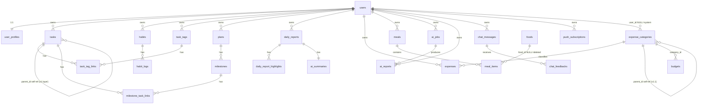

# Lifewise 数据模型设计

> 文档代号：`data-model-design`
> **版本：v1.1**（2026-07-25 修订）
> 状态：Approved
> 适用产品：数字生活 Lifewise（项目代号：照片档）
> 数据库：PostgreSQL 15+
> 维护者：架构组

---

## 修订记录（Changelog）

| 版本 | 日期 | 主要变更 |
|---|---|---|
| v1.0 | 2026-07-25 | 初版（22 个实体） |
| v1.1 | 2026-07-25 | 修正 H-1~H-5（5 处与 PRD 不符）+ M-1~M-6 优化（6 处质量改进） |
| **v1.1.1** | **2026-07-25** | **第二轮审计修正 N-1~N-3：budgets mute CHECK 语义 / 物化视图首次填充 / PG 版本依赖注释** |

**v1.1 关键变更摘要**：

| 编号 | 类型 | 变更 |
|---|---|---|
| H-1 | 🔴 高 | `daily_reports` 分区由「按年」改为「按月」（PRD 02 §8 明确要求） |
| H-2 | 🔴 高 | `meals` / `meal_items` 由未分区改为「按月分区」（PRD 04 §8 明确要求） |
| H-3 | 🔴 高 | 新增 `user_profiles` 表，覆盖 PRD MEAL-024 身高/体重/性别/活动量 + 各模块 Push 开关 + AI 隐私开关 |
| H-4 | 🔴 高 | `plans` 新增 `last_activity_at` 字段（PRD 05 §8 14 天未更新提醒） |
| H-5 | 🔴 高 | `budgets` 新增 `notify_enabled` + `notify_muted_until`（PRD 03 EXP-024「开关可关」） |
| M-1 | 🟡 中 | `daily_reports.content_md` 长度 CHECK ≤ 50000 |
| M-2 | 🟡 中 | `ai_jobs` 新增 `attempts` / `max_attempts`（PRD AI-042 重试 3 次） |
| M-3 | 🟡 中 | AI 隐私开关归入 `user_profiles`（PRD 06 §8 用户可关闭 AI） |
| M-4 | 🟡 中 | 任务/习惯/计划/消费 Push 开关归入 `user_profiles`（PRD 01/03/05 多处"开关可关"） |
| M-5 | 🟡 中 | 「其他」分类语义明确：每用户预置一个 `is_user_default` 「其他」分类 |
| M-6 | 🟡 中 | 新增 §4.1 物化视图 `mv_expense_monthly_category` DDL（PRD 03 §8 饼图性能） |
| 一致性 | ⚙️ 修 | §5 分区表与 §3 DDL 对齐；实体计数由"22 张表"修正为"24 张表（22 业务+1 user_profiles+1 users 占位）" |
| L-1 | 🟢 低 | `meal_items.servings` 加语义注释（1 = 1 份 = 100g） |
| L-2 | 🟢 低 | `tasks` 新增 `idx_tasks_user_priority_status` 索引 |
| L-3 | 🟢 低 | `chat_messages.sql_executed` 长度 CHECK ≤ 10000 |
| L-4 | 🟢 低 | `expense_categories` 预留 `parent_id`（v1.1 启用） |
| L-5 | 🟢 低 | `milestones.due_at_tz` 时区快照（推送用） |
| L-6 | 🟢 低 | `tasks.parent_id` 自循环 CHECK |
| L-7 | 🟢 低 | `outbox_events` 新增 `version` 字段（事件 schema 演进） |

---

## 0. 设计基线

| 维度 | 决策 | 依据 |
|---|---|---|
| RDBMS | PostgreSQL 15+ | PRD 6/6 模块均锁定；支持 JSONB、分区表、tsvector、partial index |
| 租户策略 | 每用户即租户，所有业务表带 `user_id`，不加 `tenant_id` | 设计评审确认；与 PRD「为个人用户提供」一致 |
| 跨模块联动 | Transactional Outbox + 异步 Worker | 防止循环触发、保证至少一次投递、可重放 |
| 软删除 | `deleted_at TIMESTAMPTZ NULL` + 日终 Job 30 天清理 | 4/6 模块明确要求 |
| 金额 | `BIGINT` 存 cents，避免浮点累加误差 | EXP §8 风险已明确 |
| 时区 | `TIMESTAMPTZ`（UTC 存）+ `users.timezone` 用于「自然日」判定 | PRD §8 task 与 habit streak 风险已明确 |
| 审计字段 | `created_at` / `updated_at` 必备 | 全部模块需要 |
| 字符集 | 数据库 `UTF8`，排序规则 `en_US.UTF-8` | 支持中文/拼音混排（食物库别名） |
| 标识列 | `BIGINT GENERATED ALWAYS AS IDENTITY` | PG 10+ 标准方式，取代 `SERIAL` |
| 用户 Profile | 独立 `user_profiles` 表（1:1 users） | PRD MEAL-024 身体参数 + 多模块 Push/AI 开关 |
| Schema 演进 | Flyway（`db/migration/V{n}__{desc}.sql`） | 与 Spring Boot 3 配套 |
| **PG 特性基线** | **PG 15+ 假定成立；分区表外键引用目标 PG 12+；generated column + GIN on partition PG 11+** | **v1.1.1 明确，避免遗漏** |

---

## 1. 概念数据模型

### 1.1 实体清单（**24 张表**，含已存在的 `users`）

#### 1.1.1 公共基础设施（**5**，新增 `user_profiles`）

| 实体 | 描述 | 关键属性 |
|---|---|---|
| `users` | 账号体系（已就绪） | `id, email, timezone, locale, status` |
| `user_profiles` | 用户个人资料 + 各模块开关（1:1 users） | `id, user_id UNIQUE, height_cm, weight_kg, gender, activity_level, daily_kcal_target, task_push_enabled, habit_push_enabled, plan_push_enabled, expense_push_enabled, ai_interpretation_enabled, ai_data_export_opt_in` |
| `push_subscriptions` | Web Push 订阅（一用户多设备） | `id, user_id, endpoint, p256dh, auth, user_agent, enabled` |
| `outbox_events` | 跨模块事件总线 | `id, user_id, aggregate_type, aggregate_id, event_type, version, payload(JSONB), occurred_at, processed_at` |
| `job_runs` | 异步 Job 运行记录 | `id, job_type, payload(JSONB), status, scheduled_at, started_at, finished_at, error` |

#### 1.1.2 任务模块 task（5）

| 实体 | 描述 | 关键属性 |
|---|---|---|
| `tasks` | 一次性任务 | `id, user_id, parent_id, title, note, priority, status, due_at, completed_at, deleted_at` |
| `task_tags` | 任务标签（私有） | `id, user_id, name, color` |
| `task_tag_links` | 任务↔标签 多对多 | `task_id, tag_id` |
| `habits` | 习惯定义 | `id, user_id, title, icon, frequency, target_count, deleted_at` |
| `habit_logs` | 习惯打卡记录 | `id, habit_id, user_id, log_date, count, source, backfill_for_date` |

#### 1.1.3 计划模块 plan（3）

| 实体 | 描述 | 关键属性 |
|---|---|---|
| `plans` | 长期目标计划 | **`id, user_id, title, description, category, status, start_at, end_at, last_activity_at, deleted_at`** |
| `milestones` | 里程碑 | `id, plan_id, user_id, title, due_at, due_at_tz, sort_order, status, completed_at, deleted_at` |
| `milestone_task_links` | 里程碑↔任务 多对多 | `milestone_id, task_id` |

#### 1.1.4 日报模块 daily_report（3）

| 实体 | 描述 | 关键属性 |
|---|---|---|
| `daily_reports` | 当日日报（一日一条，**按月分区**） | `id, user_id, report_date, mood, content_md(≤50000), weather, deleted_at` |
| `daily_report_highlights` | 亮点 tag（≤3 条 / 日报） | `id, daily_report_id, tag, position` |
| `ai_summaries` | 日报 AI 摘要 | `id, daily_report_id, summary_md, model_version, generated_at, user_edited` |

#### 1.1.5 消费模块 expense（3）

| 实体 | 描述 | 关键属性 |
|---|---|---|
| `expense_categories` | 分类（系统默认 + 自定义；每用户预置一个「其他」） | `id, user_id NULL, parent_id, name, icon, color, sort_order, is_archived, is_user_default` |
| `expenses` | 账单（**按月分区**） | `id, user_id, category_id, amount_cents, pay_method, occurred_at, note, deleted_at` |
| `budgets` | 月度预算 | `id, user_id, scope, category_id, period_year, period_month, amount_cents, notify_enabled, notify_muted_until` |

#### 1.1.6 饮食模块 meal（3）

| 实体 | 描述 | 关键属性 |
|---|---|---|
| `foods` | 食物库 | `id, owner_user_id NULL, name, aliases, category, kcal_per_100g, protein_g, carb_g, fat_g, source, deleted_at` |
| `meals` | 餐次（**按月分区**） | `id, user_id, type, occurred_at, note, total_kcal_cents, deleted_at` |
| `meal_items` | 餐次中的食物条目 | `id, meal_id, food_id, servings, manual_kcal_cents, manual_text` |

#### 1.1.7 AI 模块 ai（4）

| 实体 | 描述 | 关键属性 |
|---|---|---|
| `ai_jobs` | AI 异步 Job（含重试） | `id, user_id, type, module, period, status, progress, attempts, max_attempts, error, payload` |
| `ai_reports` | 已生成的报告 | `id, user_id, module, period_start, period_end, structured_data, llm_interpretation_md, generated_at, deleted_at` |
| `chat_messages` | 对话历史（30 天保留，**按月分区**） | `id, user_id, role, content_md, sql_executed(≤10000), source_rule_id, latency_ms, created_at` |
| `chat_feedbacks` | 问答点赞/点踩 | `id, chat_message_id, user_id, vote, comment, created_at` |

**总计：24 张表**（21 张业务表 + `users` + `user_profiles` + 3 个公共支撑表）

### 1.2 ER 图（概念层）



### 1.3 关系矩阵

| 父实体 | 子实体 | 基数 | 说明 |
|---|---|---|---|
| users | user_profiles | 1:1 | 新增（H-3） |
| users | tasks / habits / plans / daily_reports / expenses / meals / ai_jobs / ai_reports / chat_messages | 1:N | 全部按用户隔离 |
| users | push_subscriptions | 1:N | 多设备 |
| tasks | tasks（自引用 `parent_id`） | N:1 self | 单层，v1.0 限深 1 |
| tasks | task_tags | N:M | 经 `task_tag_links` |
| plans | milestones | 1:N | 删计划 → 软删里程碑 |
| milestones | tasks | N:M | 经 `milestone_task_links` |
| daily_reports | daily_report_highlights | 1:N | ≤3 条 |
| daily_reports | ai_summaries | 1:1 | 摘要必挂日报（BR-21） |
| meals | meal_items | 1:N | 删餐次 → 物理删 items |
| foods | meal_items | 1:N | 删食物 → `meal_items.food_id` 置 NULL |
| expense_categories | expenses | 1:N | 删分类 → 账单归类到「其他」（BR-20） |
| expense_categories | expense_categories（parent_id） | N:1 self | 层级（v1.1 启用） |
| chat_messages | chat_feedbacks | 1:N | 一问一反馈 |

### 1.4 关键业务规则（BR）

| 编号 | 规则 | 落地 |
|---|---|---|
| BR-01 | `tasks.priority ∈ {P0,P1,P2,P3}` | CHECK |
| BR-02 | `tasks.status ∈ {OPEN,DONE}`；DONE 时 `completed_at` 必填 | CHECK |
| BR-03 | 任务最多 5 个标签 | 应用层校验 |
| BR-04 | `habits.frequency ∈ {DAILY,WEEKLY}`，`target_count ≥ 1` | CHECK |
| BR-05 | 习惯补卡窗口 `backfill_for_date ∈ [today-3, today)`，且同习惯当天补卡请求 ≤5 次 | 应用层 + Redis 限流 |
| BR-06 | `(daily_reports.user_id, report_date)` 唯一 | UNIQUE |
| BR-07 | `mood ∈ {1, 1.5, 2, 2.5, 3, 3.5, 4, 4.5, 5}` | CHECK（NUMERIC(2,1)） |
| BR-08 | 亮点 ≤3 条 / 日报 | `position ∈ 1..3` + UNIQUE |
| BR-09 | `expenses.amount_cents > 0` | CHECK |
| BR-10 | `budgets.amount_cents > 0`；(user, scope, cat, y, m) 唯一 | UNIQUE + CHECK |
| BR-11 | `meals.type ∈ {BREAKFAST,LUNCH,DINNER,SNACK}` | CHECK |
| BR-12 | `meal_items.servings > 0` | CHECK |
| BR-13 | 食物卡路里与三大营养素 `≥ 0` | CHECK |
| BR-14 | `milestones.status ∈ {PENDING,DONE,MISSED}`；DONE 时 `completed_at` 必填；**DONE 后不再接受关联任务完成事件** | 应用层幂等键 |
| BR-15 | `plans.status ∈ {ACTIVE,DONE,ABANDONED}` | CHECK |
| BR-16 | outbox 事件去重：`(aggregate_type, aggregate_id, event_type)` 唯一 | UNIQUE |
| BR-17 | AI 速率：10 req/min、60 req/h、全局 100 req/min | Redis Token Bucket |
| BR-18 | 对话历史 30 天物理清理 | 日终 Job（按月分区 DROP） |
| BR-19 | 软删除记录 30 天物理清理 | 日终 Job |
| BR-20 | 自定义分类删除前迁移到「其他」分类（每用户预置） | 应用层事务包裹 |
| BR-21 | `ai_summaries.daily_report_id NOT NULL`；日报软删 → 级联软删摘要 | NOT NULL + 应用层 |
| BR-22 | `outbox_events.user_id NOT NULL`；Worker 按 `(user_id, occurred_at)` 分片轮询 | NOT NULL + 部分索引 |
| BR-23 | 系统分类 name 全局唯一；自定义分类用户内 name 唯一 | 两个部分 UNIQUE |
| **BR-24** | **「其他」分类为每用户预置的 `is_user_default=TRUE` 分类，不可删/不可重命名** | **CHECK + 应用层保护** |
| **BR-25** | **`daily_reports.content_md` 长度 ≤ 50000 字符**（防 Markdown 存储膨胀） | **CHECK** |
| **BR-26** | **`chat_messages.sql_executed` 长度 ≤ 10000 字符**（防 LLM 输出滥用） | **CHECK** |
| **BR-27** | **`tasks.parent_id` 不等于自身 ID；非 NULL 时 parent.user_id 必须一致** | **CHECK + 应用层** |
| **BR-28** | **`ai_jobs.attempts ≥ 0` 且 ≤ `max_attempts`**；超限自动 FAILED | **CHECK + Job 调度器** |
| **BR-29** | **`milestones.due_at_tz` 必须与创建时 `users.timezone` 一致**（推送按用户时区计算） | **应用层在 INSERT 时快照** |
| **BR-30** | **`plans.last_activity_at` 由 milestones / tasks CUD 事件刷新**（14 天未更新提醒） | **Outbox 事件消费方更新** |

### 1.5 跨模块事件清单（Outbox）

| event_type | 触发源 | 消费方 | 用途 | v1.1 变更 |
|---|---|---|---|---|
| `task.completed` | `tasks.status → DONE` | plan | 触发关联 milestone 评估 DONE | |
| `task.reopened` | `tasks.status → OPEN` | plan | 触发关联 milestone 重评估 PENDING | |
| `task.created` / `task.updated` | tasks INSERT/UPDATE | plan | 刷新 plans.last_activity_at（BR-30） | **新增** |
| `milestone.created` / `milestone.updated` | milestones CUD | plan | 刷新 plans.last_activity_at（BR-30） | **新增** |
| `milestone.completed` | `milestones.status → DONE` | ai, daily_report | 触发日报 AI 摘要生成（可选） | |
| `milestone.missed` | `milestones.status → MISSED`（MilestoneMissedJob） | ai | 跨模块洞察 | 明确触发源 |
| `habit.logged` | `habit_logs INSERT` | daily_report, ai | 习惯日报相关性 | |
| `meal.created` | `meals INSERT` | ai | 月度营养聚合增量 | **新增** |
| `expense.created` | `expenses INSERT` | ai | 月度聚合增量；预算 Push 评估 | |
| `budget.threshold` | BudgetEvaluatorJob | push_subscriptions | 超 80% / 100% Push | 明确触发源 |
| `plan.created` | `plans INSERT` | ai | 计划合理性评估（v1.1） | |
| `ai.job.completed` | `ai_jobs.status → DONE` | user | SSE 推送 | |
| `ai.report.feedback` | `chat_feedbacks INSERT` | — | 反馈收集 | |

---

## 2. 数据库基础设施

### 2.1 命名规范

| 类别 | 规范 | 示例 |
|---|---|---|
| 表名 | `snake_case`，复数 | `daily_reports` |
| 列名 | `snake_case` | `report_date` |
| 主键 | `id BIGINT` | `id` |
| 外键 | `{参照表名单数}_id` | `user_id` |
| 枚举 | CHECK + 小写字符串（PG 原生 enum 在迁移时改动成本高） | `'P0'`, `'BREAKFAST'` |
| 时间戳 | `*_at TIMESTAMPTZ` | `created_at` |
| 布尔 | `is_*` 或 `*_enabled` | `is_archived`, `enabled` |
| 索引 | `idx_{表}_{列}_{列}` | `idx_tasks_user_due` |
| 唯一索引 | `uq_{表}_{列}` | `uq_daily_reports_user_date` |
| 部分索引 | `idx_{表}_{列}_where_{条件}` | `idx_outbox_user_pending` |
| 分区表 | `{原表名}_YYYY_MM` | `daily_reports_2026_07` |

### 2.2 通用基类字段（每张业务表）

```sql
-- 每张业务表必备
id              BIGINT GENERATED ALWAYS AS IDENTITY PRIMARY KEY,
created_at      TIMESTAMPTZ NOT NULL DEFAULT NOW(),
updated_at      TIMESTAMPTZ NOT NULL DEFAULT NOW(),
deleted_at      TIMESTAMPTZ NULL
```

```sql
-- updated_at 自动更新触发器（全局一次性创建）
CREATE OR REPLACE FUNCTION set_updated_at() RETURNS TRIGGER AS $$
BEGIN
    NEW.updated_at := NOW();
    RETURN NEW;
END;
$$ LANGUAGE plpgsql;
```

### 2.3 字符集与连接

```sql
CREATE DATABASE lifewise
    WITH ENCODING 'UTF8'
         LC_COLLATE 'en_US.UTF-8'
         LC_CTYPE 'en_US.UTF-8'
         TEMPLATE template0;
```

---

## 3. 表结构 DDL

### 3.1 公共基础设施

#### 3.1.1 `users`（已存在，使用约定）

| 字段 | 类型 | 约束 |
|---|---|---|
| id | BIGINT | PK |
| email | TEXT | UNIQUE NOT NULL |
| timezone | TEXT | NOT NULL DEFAULT 'Asia/Shanghai' |
| locale | TEXT | NOT NULL DEFAULT 'zh-CN' |
| status | TEXT | NOT NULL DEFAULT 'ACTIVE' |
| created_at | TIMESTAMPTZ | NOT NULL DEFAULT NOW() |

#### 3.1.2 `user_profiles`（**新增 H-3**）

```sql
CREATE TABLE user_profiles (
    id                          BIGINT GENERATED ALWAYS AS IDENTITY PRIMARY KEY,
    user_id                     BIGINT NOT NULL UNIQUE REFERENCES users(id) ON DELETE CASCADE,

    -- 身体参数（PRD MEAL-024）
    height_cm                   NUMERIC(5,1) NULL CHECK (height_cm IS NULL OR (height_cm BETWEEN 50 AND 250)),
    weight_kg                   NUMERIC(5,1) NULL CHECK (weight_kg IS NULL OR (weight_kg BETWEEN 10 AND 300)),
    gender                      TEXT NULL CHECK (gender IN ('MALE','FEMALE','OTHER') OR gender IS NULL),
    birth_date                  DATE NULL,
    activity_level              TEXT NULL
                                CHECK (activity_level IN ('SEDENTARY','LIGHT','MODERATE','ACTIVE','VERY_ACTIVE')
                                       OR activity_level IS NULL),
    daily_kcal_target           INT NULL CHECK (daily_kcal_target IS NULL OR daily_kcal_target BETWEEN 500 AND 6000),

    -- 各模块 Push 开关（PRD 01/03/05 多处"开关可关"）
    task_push_enabled           BOOLEAN NOT NULL DEFAULT TRUE,
    habit_push_enabled          BOOLEAN NOT NULL DEFAULT TRUE,
    plan_push_enabled           BOOLEAN NOT NULL DEFAULT TRUE,
    expense_push_enabled        BOOLEAN NOT NULL DEFAULT TRUE,

    -- AI 隐私与功能开关（PRD 06 §8 用户可关闭 AI 解读）
    ai_interpretation_enabled   BOOLEAN NOT NULL DEFAULT TRUE,
    ai_data_export_opt_in       BOOLEAN NOT NULL DEFAULT FALSE,  -- 数据是否允许送 LLM（本地 Ollama 默认 FALSE）

    created_at                  TIMESTAMPTZ NOT NULL DEFAULT NOW(),
    updated_at                  TIMESTAMPTZ NOT NULL DEFAULT NOW()
);

CREATE INDEX idx_user_profiles_user ON user_profiles(user_id);
```

> **推荐摄入估算算法**（应用层）：`MALE: 10*weight + 6.25*height - 5*age + 5`，按 `activity_level` 系数 ×1.2~1.9。估算结果回写 `daily_kcal_target`，用户可手动覆盖。

#### 3.1.3 `push_subscriptions`

```sql
CREATE TABLE push_subscriptions (
    id              BIGINT GENERATED ALWAYS AS IDENTITY PRIMARY KEY,
    user_id         BIGINT NOT NULL REFERENCES users(id) ON DELETE CASCADE,
    endpoint        TEXT NOT NULL,
    p256dh          TEXT NOT NULL,
    auth            TEXT NOT NULL,
    user_agent      TEXT NULL,
    enabled         BOOLEAN NOT NULL DEFAULT TRUE,
    created_at      TIMESTAMPTZ NOT NULL DEFAULT NOW(),
    updated_at      TIMESTAMPTZ NOT NULL DEFAULT NOW(),
    UNIQUE (user_id, endpoint)
);

CREATE INDEX idx_push_subs_user_enabled
    ON push_subscriptions(user_id) WHERE enabled = TRUE;
```

#### 3.1.4 `outbox_events`（**新增 L-7** version 字段）

```sql
CREATE TABLE outbox_events (
    id              BIGINT GENERATED ALWAYS AS IDENTITY PRIMARY KEY,
    user_id         BIGINT NOT NULL REFERENCES users(id) ON DELETE CASCADE,
    aggregate_type  TEXT NOT NULL,    -- 'task' | 'plan' | 'expense' | 'meal' | ...
    aggregate_id    BIGINT NOT NULL,
    event_type      TEXT NOT NULL,    -- 'task.completed' | ...
    version         INT NOT NULL DEFAULT 1,  -- 事件 schema 版本，用于兼容演进
    payload         JSONB NOT NULL,
    occurred_at     TIMESTAMPTZ NOT NULL DEFAULT NOW(),
    processed_at    TIMESTAMPTZ NULL,
    attempts        INT NOT NULL DEFAULT 0,
    last_error      TEXT NULL,
    UNIQUE (aggregate_type, aggregate_id, event_type, version)
);

CREATE INDEX idx_outbox_user_pending
    ON outbox_events(user_id, occurred_at)
    WHERE processed_at IS NULL;

CREATE INDEX idx_outbox_pending_occurred
    ON outbox_events(occurred_at)
    WHERE processed_at IS NULL;
```

#### 3.1.5 `job_runs`

```sql
CREATE TABLE job_runs (
    id              BIGINT GENERATED ALWAYS AS IDENTITY PRIMARY KEY,
    job_type        TEXT NOT NULL,
    payload         JSONB NOT NULL,
    status          TEXT NOT NULL DEFAULT 'PENDING'
                    CHECK (status IN ('PENDING','RUNNING','DONE','FAILED','CANCELLED')),
    scheduled_at    TIMESTAMPTZ NOT NULL DEFAULT NOW(),
    started_at      TIMESTAMPTZ NULL,
    finished_at     TIMESTAMPTZ NULL,
    error           TEXT NULL,
    created_at      TIMESTAMPTZ NOT NULL DEFAULT NOW(),
    updated_at      TIMESTAMPTZ NOT NULL DEFAULT NOW()
);

CREATE INDEX idx_job_runs_type_status_sched
    ON job_runs(job_type, status, scheduled_at);
```

### 3.2 任务模块

#### 3.2.1 `tasks`（**新增 L-2 + L-6**）

```sql
CREATE TABLE tasks (
    id              BIGINT GENERATED ALWAYS AS IDENTITY PRIMARY KEY,
    user_id         BIGINT NOT NULL REFERENCES users(id) ON DELETE CASCADE,
    parent_id       BIGINT NULL REFERENCES tasks(id) ON DELETE CASCADE,
    title           TEXT NOT NULL CHECK (length(title) BETWEEN 1 AND 200),
    note            TEXT NULL,
    priority        TEXT NOT NULL DEFAULT 'P3'
                    CHECK (priority IN ('P0','P1','P2','P3')),
    status          TEXT NOT NULL DEFAULT 'OPEN'
                    CHECK (status IN ('OPEN','DONE')),
    due_at          TIMESTAMPTZ NULL,
    completed_at    TIMESTAMPTZ NULL,
    deleted_at      TIMESTAMPTZ NULL,
    created_at      TIMESTAMPTZ NOT NULL DEFAULT NOW(),
    updated_at      TIMESTAMPTZ NOT NULL DEFAULT NOW(),
    -- BR-02：DONE 时 completed_at 必填
    CHECK ((status = 'DONE' AND completed_at IS NOT NULL)
        OR (status = 'OPEN')),
    -- BR-27：parent_id ≠ self（应用层校验 parent.user_id 一致）
    CHECK (parent_id IS NULL OR parent_id <> id)
);

-- 看板视图按优先级 + 状态筛选
CREATE INDEX idx_tasks_user_priority_status
    ON tasks(user_id, priority, status)
    WHERE deleted_at IS NULL;

CREATE INDEX idx_tasks_user_status_due
    ON tasks(user_id, status, due_at)
    WHERE deleted_at IS NULL;

CREATE INDEX idx_tasks_user_parent
    ON tasks(user_id, parent_id)
    WHERE deleted_at IS NULL;

CREATE INDEX idx_tasks_user_created
    ON tasks(user_id, created_at DESC)
    WHERE deleted_at IS NULL;
```

#### 3.2.2 `task_tags`

```sql
CREATE TABLE task_tags (
    id              BIGINT GENERATED ALWAYS AS IDENTITY PRIMARY KEY,
    user_id         BIGINT NOT NULL REFERENCES users(id) ON DELETE CASCADE,
    name            TEXT NOT NULL CHECK (length(name) BETWEEN 1 AND 30),
    color           TEXT NULL,
    created_at      TIMESTAMPTZ NOT NULL DEFAULT NOW(),
    UNIQUE (user_id, name)
);

CREATE INDEX idx_task_tags_user ON task_tags(user_id);
```

#### 3.2.3 `task_tag_links`

```sql
CREATE TABLE task_tag_links (
    task_id         BIGINT NOT NULL REFERENCES tasks(id) ON DELETE CASCADE,
    tag_id          BIGINT NOT NULL REFERENCES task_tags(id) ON DELETE CASCADE,
    PRIMARY KEY (task_id, tag_id)
);

CREATE INDEX idx_task_tag_links_tag ON task_tag_links(tag_id);
```

#### 3.2.4 `habits`

```sql
CREATE TABLE habits (
    id              BIGINT GENERATED ALWAYS AS IDENTITY PRIMARY KEY,
    user_id         BIGINT NOT NULL REFERENCES users(id) ON DELETE CASCADE,
    title           TEXT NOT NULL CHECK (length(title) BETWEEN 1 AND 100),
    icon            TEXT NULL,
    frequency       TEXT NOT NULL DEFAULT 'DAILY'
                    CHECK (frequency IN ('DAILY','WEEKLY')),
    target_count    INT NOT NULL DEFAULT 1 CHECK (target_count >= 1),
    current_streak  INT NOT NULL DEFAULT 0,
    longest_streak  INT NOT NULL DEFAULT 0,
    last_logged_date DATE NULL,
    deleted_at      TIMESTAMPTZ NULL,
    created_at      TIMESTAMPTZ NOT NULL DEFAULT NOW(),
    updated_at      TIMESTAMPTZ NOT NULL DEFAULT NOW()
);

CREATE INDEX idx_habits_user_active
    ON habits(user_id)
    WHERE deleted_at IS NULL;
```

#### 3.2.5 `habit_logs`

```sql
CREATE TABLE habit_logs (
    id                  BIGINT GENERATED ALWAYS AS IDENTITY PRIMARY KEY,
    habit_id            BIGINT NOT NULL REFERENCES habits(id) ON DELETE CASCADE,
    user_id             BIGINT NOT NULL REFERENCES users(id) ON DELETE CASCADE,
    log_date            DATE NOT NULL,
    count               INT NOT NULL DEFAULT 1 CHECK (count >= 1),
    source              TEXT NOT NULL DEFAULT 'NORMAL'
                        CHECK (source IN ('NORMAL','BACKFILL')),
    backfill_for_date   DATE NULL,
    created_at          TIMESTAMPTZ NOT NULL DEFAULT NOW(),
    UNIQUE (habit_id, log_date),
    CHECK (source = 'NORMAL' OR
          (source = 'BACKFILL' AND backfill_for_date IS NOT NULL
           AND backfill_for_date <= CURRENT_DATE
           AND backfill_for_date >  CURRENT_DATE - INTERVAL '3 days'))
);

CREATE INDEX idx_habit_logs_user_date
    ON habit_logs(user_id, log_date DESC);
```

### 3.3 计划模块

#### 3.3.1 `plans`（**新增 H-4 `last_activity_at`**）

```sql
CREATE TABLE plans (
    id                  BIGINT GENERATED ALWAYS AS IDENTITY PRIMARY KEY,
    user_id             BIGINT NOT NULL REFERENCES users(id) ON DELETE CASCADE,
    title               TEXT NOT NULL CHECK (length(title) BETWEEN 1 AND 200),
    description         TEXT NULL,
    category            TEXT NOT NULL DEFAULT 'OTHER'
                        CHECK (category IN ('STUDY','WORK','HEALTH','LIFE','FINANCE','OTHER')),
    status              TEXT NOT NULL DEFAULT 'ACTIVE'
                        CHECK (status IN ('ACTIVE','DONE','ABANDONED')),
    start_at            DATE NOT NULL,
    end_at              DATE NOT NULL,
    last_activity_at    TIMESTAMPTZ NOT NULL DEFAULT NOW(),  -- H-4：BR-30 14 天提醒
    deleted_at          TIMESTAMPTZ NULL,
    created_at          TIMESTAMPTZ NOT NULL DEFAULT NOW(),
    updated_at          TIMESTAMPTZ NOT NULL DEFAULT NOW(),
    CHECK (end_at >= start_at)
);

CREATE INDEX idx_plans_user_status_end
    ON plans(user_id, status, end_at)
    WHERE deleted_at IS NULL;

-- H-4：扫描超过 14 天未更新的活跃计划
CREATE INDEX idx_plans_user_last_activity
    ON plans(user_id, last_activity_at)
    WHERE deleted_at IS NULL AND status = 'ACTIVE';
```

> **`last_activity_at` 更新机制**：消费 `task.created` / `task.updated` / `milestone.created` / `milestone.updated` 事件时，事件处理器通过 `milestone_task_links` → `tasks` 或直接 `milestones.plan_id` 反查，写 `UPDATE plans SET last_activity_at = NOW() WHERE id = ?`

#### 3.3.2 `milestones`（**新增 L-5 `due_at_tz`**）

```sql
CREATE TABLE milestones (
    id              BIGINT GENERATED ALWAYS AS IDENTITY PRIMARY KEY,
    plan_id         BIGINT NOT NULL REFERENCES plans(id) ON DELETE CASCADE,
    user_id         BIGINT NOT NULL REFERENCES users(id) ON DELETE CASCADE,
    title           TEXT NOT NULL CHECK (length(title) BETWEEN 1 AND 200),
    due_at          DATE NOT NULL,
    due_at_tz       TEXT NOT NULL DEFAULT 'Asia/Shanghai',  -- L-5：创建时快照用户时区
    sort_order      INT NOT NULL DEFAULT 0,
    status          TEXT NOT NULL DEFAULT 'PENDING'
                    CHECK (status IN ('PENDING','DONE','MISSED')),
    completed_at    TIMESTAMPTZ NULL,
    deleted_at      TIMESTAMPTZ NULL,
    created_at      TIMESTAMPTZ NOT NULL DEFAULT NOW(),
    updated_at      TIMESTAMPTZ NOT NULL DEFAULT NOW(),
    CHECK ((status = 'DONE' AND completed_at IS NOT NULL)
        OR (status <> 'DONE'))
);

CREATE INDEX idx_milestones_plan_due
    ON milestones(plan_id, status, due_at)
    WHERE deleted_at IS NULL;

CREATE INDEX idx_milestones_user_status_due
    ON milestones(user_id, status, due_at)
    WHERE deleted_at IS NULL;
```

#### 3.3.3 `milestone_task_links`

```sql
CREATE TABLE milestone_task_links (
    milestone_id    BIGINT NOT NULL REFERENCES milestones(id) ON DELETE CASCADE,
    task_id         BIGINT NOT NULL REFERENCES tasks(id) ON DELETE CASCADE,
    created_at      TIMESTAMPTZ NOT NULL DEFAULT NOW(),
    PRIMARY KEY (milestone_id, task_id)
);

CREATE INDEX idx_milestone_task_links_task
    ON milestone_task_links(task_id);
```

### 3.4 日报模块

#### 3.4.1 `daily_reports`（**H-1 改按月分区 + M-1 长度 CHECK**）

```sql
-- 主表声明：按 report_date 按月分区
CREATE TABLE daily_reports (
    id              BIGINT GENERATED ALWAYS AS IDENTITY PRIMARY KEY,
    user_id         BIGINT NOT NULL REFERENCES users(id) ON DELETE CASCADE,
    report_date     DATE NOT NULL,
    mood            NUMERIC(2,1) NOT NULL
                    CHECK (mood IN (1.0,1.5,2.0,2.5,3.0,3.5,4.0,4.5,5.0)),
    content_md      TEXT NULL CHECK (length(content_md) <= 50000),  -- M-1 / BR-25
    weather         TEXT NULL
                    CHECK (weather IN ('SUNNY','CLOUDY','RAINY','SNOWY','FOGGY') OR weather IS NULL),
    deleted_at      TIMESTAMPTZ NULL,
    created_at      TIMESTAMPTZ NOT NULL DEFAULT NOW(),
    updated_at      TIMESTAMPTZ NOT NULL DEFAULT NOW(),
    UNIQUE (user_id, report_date)
) PARTITION BY RANGE (report_date);

-- 分区由 §5.1 EnsurePartitionJob 自动创建，初始迁移 V6 创建当月 + 下月

CREATE INDEX idx_daily_reports_user_date
    ON daily_reports(user_id, report_date DESC)
    WHERE deleted_at IS NULL;

ALTER TABLE daily_reports ADD COLUMN content_tsv tsvector
    GENERATED ALWAYS AS (to_tsvector('simple', coalesce(content_md,''))) STORED;

CREATE INDEX idx_daily_reports_tsv
    ON daily_reports USING GIN(content_tsv);
```

> **v1.0 → v1.1 变更**：分区粒度从「按年」改为「按月」（H-1）。旧文档 §5.1 的 `daily_reports_2026` 改为 `daily_reports_2026_07`。
>
> **N-3 v1.1.1：PG 版本依赖**：
> - `GENERATED ALWAYS AS ... STORED` + `GIN` 索引在分区表上 → PG 11+
> - 本表作为外键引用目标（`daily_report_highlights` / `ai_summaries`） → PG 12+
> - 文档基线 PG 15+ 满足。

#### 3.4.2 `daily_report_highlights`

```sql
CREATE TABLE daily_report_highlights (
    id                  BIGINT GENERATED ALWAYS AS IDENTITY PRIMARY KEY,
    daily_report_id     BIGINT NOT NULL REFERENCES daily_reports(id) ON DELETE CASCADE,
    tag                 TEXT NOT NULL CHECK (length(tag) BETWEEN 1 AND 20),
    position            INT NOT NULL CHECK (position BETWEEN 1 AND 3),
    UNIQUE (daily_report_id, position)
);

CREATE INDEX idx_dr_highlights_report ON daily_report_highlights(daily_report_id);
```

> N-3 v1.1.1：`REFERENCES daily_reports(id)` 要求 daily_reports 是分区表，分区表作为外键引用目标是 PG 12+ 特性；文档基线 PG 15+ 满足。

#### 3.4.3 `ai_summaries`

```sql
CREATE TABLE ai_summaries (
    id                  BIGINT GENERATED ALWAYS AS IDENTITY PRIMARY KEY,
    daily_report_id     BIGINT NOT NULL REFERENCES daily_reports(id) ON DELETE CASCADE,
    summary_md          TEXT NOT NULL,
    model_version       TEXT NOT NULL,    -- 'ollama:deepseek:8b'
    generated_at        TIMESTAMPTZ NOT NULL DEFAULT NOW(),
    user_edited         BOOLEAN NOT NULL DEFAULT FALSE,
    UNIQUE (daily_report_id)
);

CREATE INDEX idx_ai_summaries_report ON ai_summaries(daily_report_id);
```

> BR-21：`daily_report_id NOT NULL`；日报软删 → 级联软删摘要（应用层；也可改为 ON DELETE CASCADE 物理级联，但保留软删除语义更安全，故放应用层）
>
> N-3 v1.1.1：`REFERENCES daily_reports(id)` 要求 daily_reports 是分区表 → PG 12+；文档基线 PG 15+ 满足。

### 3.5 消费模块

#### 3.5.1 `expense_categories`（**新增 M-5 `is_user_default` + L-4 `parent_id`**）

```sql
CREATE TABLE expense_categories (
    id                  BIGINT GENERATED ALWAYS AS IDENTITY PRIMARY KEY,
    user_id             BIGINT NULL REFERENCES users(id) ON DELETE CASCADE,  -- NULL = 系统默认
    parent_id           BIGINT NULL REFERENCES expense_categories(id) ON DELETE SET NULL,  -- L-4 预留
    name                TEXT NOT NULL CHECK (length(name) BETWEEN 1 AND 20),
    icon                TEXT NULL,
    color               TEXT NULL,
    sort_order          INT NOT NULL DEFAULT 0,
    is_archived         BOOLEAN NOT NULL DEFAULT FALSE,
    is_user_default     BOOLEAN NOT NULL DEFAULT FALSE,  -- M-5：每用户预置的「其他」分类
    created_at          TIMESTAMPTZ NOT NULL DEFAULT NOW(),
    updated_at          TIMESTAMPTZ NOT NULL DEFAULT NOW(),
    -- BR-24：is_user_default 的分类不可归档/删除
    CHECK (is_user_default = FALSE OR (is_archived = FALSE AND user_id IS NOT NULL))
);

-- BR-23：系统分类 name 全局唯一
CREATE UNIQUE INDEX uq_expense_categories_system_name
    ON expense_categories(name) WHERE user_id IS NULL;

-- BR-23：自定义分类用户内 name 唯一
CREATE UNIQUE INDEX uq_expense_categories_user_name
    ON expense_categories(user_id, name) WHERE user_id IS NOT NULL;

-- BR-24：每个用户最多一个 is_user_default 分类
CREATE UNIQUE INDEX uq_expense_categories_user_default
    ON expense_categories(user_id) WHERE is_user_default = TRUE;

CREATE INDEX idx_expense_categories_user_active
    ON expense_categories(user_id, sort_order)
    WHERE is_archived = FALSE;
```

#### 3.5.2 `expenses`（**新增按月分区 H-2 范围内补全**）

```sql
CREATE TABLE expenses (
    id              BIGINT GENERATED ALWAYS AS IDENTITY PRIMARY KEY,
    user_id         BIGINT NOT NULL REFERENCES users(id) ON DELETE CASCADE,
    category_id     BIGINT NOT NULL REFERENCES expense_categories(id) ON DELETE RESTRICT,
    amount_cents    BIGINT NOT NULL CHECK (amount_cents > 0),  -- BR-09
    pay_method      TEXT NOT NULL DEFAULT 'CASH'
                    CHECK (pay_method IN ('CASH','ALIPAY','WECHAT','BANK')),
    occurred_at     TIMESTAMPTZ NOT NULL DEFAULT NOW(),
    note            TEXT NULL CHECK (length(note) <= 200),
    deleted_at      TIMESTAMPTZ NULL,
    created_at      TIMESTAMPTZ NOT NULL DEFAULT NOW(),
    updated_at      TIMESTAMPTZ NOT NULL DEFAULT NOW()
) PARTITION BY RANGE (occurred_at);

CREATE INDEX idx_expenses_user_occurred
    ON expenses(user_id, occurred_at DESC)
    WHERE deleted_at IS NULL;

CREATE INDEX idx_expenses_user_category_occurred
    ON expenses(user_id, category_id, occurred_at DESC)
    WHERE deleted_at IS NULL;
```

#### 3.5.3 `budgets`（**新增 H-5 notify 字段**）

```sql
CREATE TABLE budgets (
    id                  BIGINT GENERATED ALWAYS AS IDENTITY PRIMARY KEY,
    user_id             BIGINT NOT NULL REFERENCES users(id) ON DELETE CASCADE,
    scope               TEXT NOT NULL CHECK (scope IN ('TOTAL','CATEGORY')),
    category_id         BIGINT NULL REFERENCES expense_categories(id) ON DELETE RESTRICT,
    period_year         INT NOT NULL CHECK (period_year BETWEEN 2000 AND 2100),
    period_month        INT NOT NULL CHECK (period_month BETWEEN 1 AND 12),
    amount_cents        BIGINT NOT NULL CHECK (amount_cents > 0),  -- BR-10
    notify_enabled      BOOLEAN NOT NULL DEFAULT TRUE,           -- H-5 / PRD EXP-024
    notify_muted_until  DATE NULL,                                -- H-5 / PRD US-EXP-03 AC-3 关闭本月
    created_at          TIMESTAMPTZ NOT NULL DEFAULT NOW(),
    updated_at          TIMESTAMPTZ NOT NULL DEFAULT NOW(),
    UNIQUE (user_id, scope, category_id, period_year, period_month),
    CHECK ((scope = 'TOTAL' AND category_id IS NULL)
        OR (scope = 'CATEGORY' AND category_id IS NOT NULL)),
    -- N-1 v1.1.1：mute 必须落在当前预算周期内（≥ 月初 且 < 下月初，INTERVAL 自动处理 12 月跨年）
    CHECK (
        notify_muted_until IS NULL OR (
            notify_muted_until >= make_date(period_year, period_month, 1)
            AND notify_muted_until <  (make_date(period_year, period_month, 1) + INTERVAL '1 month')::date
        )
    )
);

CREATE INDEX idx_budgets_user_period
    ON budgets(user_id, period_year DESC, period_month DESC);

-- BudgetEvaluatorJob 扫描待评估预算时过滤"未静音"
CREATE INDEX idx_budgets_active_notify
    ON budgets(user_id, period_year, period_month)
    WHERE notify_enabled = TRUE;
```

> **`BudgetEvaluatorJob` 评估逻辑**：
> ```
> WHERE period_year = ? AND period_month = ?
>   AND notify_enabled = TRUE
>   AND (notify_muted_until IS NULL OR notify_muted_until > CURRENT_DATE)
> ```
>
> **N-1 v1.1.1 语义保证**：CHECK 约束保证 `notify_muted_until` 一定在当前 period 内，所以"mute 到下月初"的行为会自动跨月失效。应用层不需要再判断 `notify_muted_until >= period_end`。

### 3.6 饮食模块

#### 3.6.1 `foods`

```sql
CREATE TABLE foods (
    id                  BIGINT GENERATED ALWAYS AS IDENTITY PRIMARY KEY,
    owner_user_id       BIGINT NULL REFERENCES users(id) ON DELETE CASCADE,
    name                TEXT NOT NULL,
    aliases             TEXT[] NOT NULL DEFAULT '{}',
    category            TEXT NOT NULL
                        CHECK (category IN ('STAPLE','MEAT','VEG','FRUIT','DRINK','SNACK')),
    kcal_per_100g       NUMERIC(7,2) NOT NULL CHECK (kcal_per_100g >= 0),
    protein_g           NUMERIC(7,2) NOT NULL DEFAULT 0 CHECK (protein_g >= 0),
    carb_g              NUMERIC(7,2) NOT NULL DEFAULT 0 CHECK (carb_g >= 0),
    fat_g               NUMERIC(7,2) NOT NULL DEFAULT 0 CHECK (fat_g >= 0),
    source              TEXT NULL,
    deleted_at          TIMESTAMPTZ NULL,
    created_at          TIMESTAMPTZ NOT NULL DEFAULT NOW(),
    updated_at          TIMESTAMPTZ NOT NULL DEFAULT NOW()
);

CREATE UNIQUE INDEX uq_foods_system_name
    ON foods(lower(name)) WHERE owner_user_id IS NULL AND deleted_at IS NULL;

CREATE UNIQUE INDEX uq_foods_user_name
    ON foods(owner_user_id, lower(name))
    WHERE owner_user_id IS NOT NULL AND deleted_at IS NULL;

CREATE EXTENSION IF NOT EXISTS pg_trgm;

CREATE INDEX idx_foods_name_trgm
    ON foods USING GIN(name gin_trgm_ops);

CREATE INDEX idx_foods_owner_category
    ON foods(owner_user_id, category)
    WHERE deleted_at IS NULL;
```

#### 3.6.2 `meals`（**新增 H-2 按月分区**）

```sql
CREATE TABLE meals (
    id                  BIGINT GENERATED ALWAYS AS IDENTITY PRIMARY KEY,
    user_id             BIGINT NOT NULL REFERENCES users(id) ON DELETE CASCADE,
    type                TEXT NOT NULL
                        CHECK (type IN ('BREAKFAST','LUNCH','DINNER','SNACK')),
    occurred_at         TIMESTAMPTZ NOT NULL DEFAULT NOW(),
    note                TEXT NULL CHECK (length(note) <= 200),
    total_kcal_cents    BIGINT NULL,
    deleted_at          TIMESTAMPTZ NULL,
    created_at          TIMESTAMPTZ NOT NULL DEFAULT NOW(),
    updated_at          TIMESTAMPTZ NOT NULL DEFAULT NOW()
) PARTITION BY RANGE (occurred_at);

CREATE INDEX idx_meals_user_occurred
    ON meals(user_id, occurred_at DESC)
    WHERE deleted_at IS NULL;
```

#### 3.6.3 `meal_items`（**新增 L-1 servings 语义注释**）

```sql
CREATE TABLE meal_items (
    id                  BIGINT GENERATED ALWAYS AS IDENTITY PRIMARY KEY,
    meal_id             BIGINT NOT NULL REFERENCES meals(id) ON DELETE CASCADE,
    food_id             BIGINT NULL REFERENCES foods(id) ON DELETE SET NULL,
    -- L-1 / PRD MEAL-004：servings 语义为"份数"，1 serving = 100g
    -- 卡路里换算公式（应用层）：item_kcal = food.kcal_per_100g * servings
    servings            NUMERIC(6,2) NOT NULL CHECK (servings > 0),  -- BR-12
    manual_kcal_cents   BIGINT NULL,        -- 懒人模式直接输入卡路里（cents）
    manual_text         TEXT NULL           -- 懒人模式文本
);

CREATE INDEX idx_meal_items_meal ON meal_items(meal_id);
CREATE INDEX idx_meal_items_food ON meal_items(food_id) WHERE food_id IS NOT NULL;
```

### 3.7 AI 模块

#### 3.7.1 `ai_jobs`（**新增 M-2 重试字段**）

```sql
CREATE TABLE ai_jobs (
    id              BIGINT GENERATED ALWAYS AS IDENTITY PRIMARY KEY,
    user_id         BIGINT NOT NULL REFERENCES users(id) ON DELETE CASCADE,
    type            TEXT NOT NULL CHECK (type IN ('GENERATE_REPORT','QA_CHAT')),
    module          TEXT NULL
                    CHECK (module IN ('task','daily_report','expense','meal','plan') OR module IS NULL),
    period          JSONB NULL,
    payload         JSONB NOT NULL DEFAULT '{}',
    status          TEXT NOT NULL DEFAULT 'PENDING'
                    CHECK (status IN ('PENDING','RUNNING','DONE','FAILED','CANCELLED')),
    progress        INT NOT NULL DEFAULT 0 CHECK (progress BETWEEN 0 AND 100),
    attempts        INT NOT NULL DEFAULT 0 CHECK (attempts >= 0),       -- M-2 / BR-28
    max_attempts    INT NOT NULL DEFAULT 3 CHECK (max_attempts BETWEEN 1 AND 10),  -- M-2 / PRD AI-042
    error           TEXT NULL,
    started_at      TIMESTAMPTZ NULL,
    finished_at     TIMESTAMPTZ NULL,
    created_at      TIMESTAMPTZ NOT NULL DEFAULT NOW(),
    updated_at      TIMESTAMPTZ NOT NULL DEFAULT NOW(),
    CHECK (attempts <= max_attempts)
);

CREATE INDEX idx_ai_jobs_user_created
    ON ai_jobs(user_id, created_at DESC);

CREATE INDEX idx_ai_jobs_status_created
    ON ai_jobs(status, created_at)
    WHERE status IN ('PENDING','RUNNING');
```

#### 3.7.2 `ai_reports`

```sql
CREATE TABLE ai_reports (
    id                      BIGINT GENERATED ALWAYS AS IDENTITY PRIMARY KEY,
    user_id                 BIGINT NOT NULL REFERENCES users(id) ON DELETE CASCADE,
    module                  TEXT NOT NULL
                            CHECK (module IN ('task','daily_report','expense','meal','plan')),
    period_start            DATE NOT NULL,
    period_end              DATE NOT NULL,
    structured_data         JSONB NOT NULL,
    llm_interpretation_md   TEXT NULL,
    generated_at            TIMESTAMPTZ NOT NULL DEFAULT NOW(),
    deleted_at              TIMESTAMPTZ NULL,
    created_at              TIMESTAMPTZ NOT NULL DEFAULT NOW(),
    updated_at              TIMESTAMPTZ NOT NULL DEFAULT NOW(),
    CHECK (period_end >= period_start)
);

CREATE INDEX idx_ai_reports_user_module_period
    ON ai_reports(user_id, module, period_start DESC)
    WHERE deleted_at IS NULL;

CREATE INDEX idx_ai_reports_structured
    ON ai_reports USING GIN(structured_data);
```

#### 3.7.3 `chat_messages`（**新增 L-3 sql 长度 CHECK**）

```sql
CREATE TABLE chat_messages (
    id              BIGINT GENERATED ALWAYS AS IDENTITY PRIMARY KEY,
    user_id         BIGINT NOT NULL REFERENCES users(id) ON DELETE CASCADE,
    role            TEXT NOT NULL CHECK (role IN ('USER','ASSISTANT','SYSTEM')),
    content_md      TEXT NOT NULL,
    sql_executed    TEXT NULL CHECK (length(sql_executed) <= 10000),  -- L-3 / BR-26
    source_rule_id  TEXT NULL,
    latency_ms      INT NULL,
    created_at      TIMESTAMPTZ NOT NULL DEFAULT NOW()
) PARTITION BY RANGE (created_at);

CREATE INDEX idx_chat_messages_user_created
    ON chat_messages(user_id, created_at DESC);
```

#### 3.7.4 `chat_feedbacks`

```sql
CREATE TABLE chat_feedbacks (
    id                  BIGINT GENERATED ALWAYS AS IDENTITY PRIMARY KEY,
    chat_message_id     BIGINT NOT NULL REFERENCES chat_messages(id) ON DELETE CASCADE,
    user_id             BIGINT NOT NULL REFERENCES users(id) ON DELETE CASCADE,
    vote                TEXT NOT NULL CHECK (vote IN ('UP','DOWN')),
    comment             TEXT NULL,
    created_at          TIMESTAMPTZ NOT NULL DEFAULT NOW(),
    UNIQUE (chat_message_id, user_id)
);

CREATE INDEX idx_chat_feedbacks_user ON chat_feedbacks(user_id, created_at DESC);
```

> N-3 v1.1.1：`REFERENCES chat_messages(id)` 要求 chat_messages 是分区表 → PG 12+；文档基线 PG 15+ 满足。

---

## 4. 索引设计汇总

| 表 | 索引 | 类型 | 目的 | v1.1 变更 |
|---|---|---|---|---|
| **user_profiles** | `idx_user_profiles_user` | B-Tree（UNIQUE 隐含） | 1:1 关联查询 | **新增** |
| tasks | `idx_tasks_user_priority_status` | B-Tree（partial） | 看板视图按优先级 | **新增** |
| tasks | `idx_tasks_user_status_due` | B-Tree（partial） | 今日/本周列表 | |
| tasks | `idx_tasks_user_parent` | B-Tree（partial） | 子任务查询 | |
| habits | `idx_habits_user_active` | B-Tree（partial） | 活跃习惯列表 | |
| habit_logs | `UNIQUE(habit_id, log_date)` | B-Tree | 一日一卡 | |
| habit_logs | `idx_habit_logs_user_date` | B-Tree | 习惯日历查询 | |
| plans | `idx_plans_user_status_end` | B-Tree（partial） | 计划列表 | |
| plans | `idx_plans_user_last_activity` | B-Tree（partial） | **14 天未更新提醒** | **新增** |
| milestones | `idx_milestones_plan_due` | B-Tree（partial） | 计划详情 | |
| milestones | `idx_milestones_user_status_due` | B-Tree（partial） | 临近里程碑 | |
| daily_reports | `idx_daily_reports_tsv` | GIN | 全文搜索 | |
| daily_reports | `idx_daily_reports_user_date` | B-Tree | 时间线 | |
| expenses | `idx_expenses_user_occurred` | B-Tree（partial） | 列表查询 | |
| expenses | `idx_expenses_user_category_occurred` | B-Tree（partial） | 分类筛选 | |
| budgets | `idx_budgets_active_notify` | B-Tree（partial） | **BudgetEvaluatorJob 扫描** | **新增** |
| foods | `idx_foods_name_trgm` | GIN（pg_trgm） | 拼音首字母 + 模糊 | |
| expense_categories | `uq_expense_categories_system_name` | B-Tree（partial） | BR-23 | |
| expense_categories | `uq_expense_categories_user_default` | B-Tree（partial） | **BR-24** | **新增** |
| outbox_events | `idx_outbox_user_pending` | B-Tree（partial） | Worker 分片轮询 | |
| ai_reports | `idx_ai_reports_structured` | GIN | 报告 JSON 查询 | |
| ai_jobs | `idx_ai_jobs_status_created` | B-Tree（partial） | Worker 拉取 | |

---

## 4.1 物化视图（M-6）

```sql
-- 月度消费分类聚合：用于饼图与 AI 报告
CREATE MATERIALIZED VIEW mv_expense_monthly_category AS
SELECT
    user_id,
    date_trunc('month', occurred_at AT TIME ZONE 'Asia/Shanghai')::date AS period_month,
    category_id,
    SUM(amount_cents)                  AS total_cents,
    COUNT(*)                           AS expense_count,
    MAX(occurred_at)                   AS last_occurred_at
FROM expenses
WHERE deleted_at IS NULL
GROUP BY user_id, date_trunc('month', occurred_at), category_id;

CREATE UNIQUE INDEX uq_mv_expense_monthly_cat
    ON mv_expense_monthly_category(user_id, period_month, category_id);

CREATE INDEX idx_mv_expense_monthly_cat_user_period
    ON mv_expense_monthly_category(user_id, period_month DESC);

-- N-2 v1.1.1：首次填充策略
-- CREATE MATERIALIZED VIEW 默认 WITH NO DATA，V18 迁移末尾必须先做一次非 CONCURRENTLY 刷新
-- 应用层读取时优先查此视图；物化视图不存在数据时回退实时聚合

-- 刷新策略：
--   • 首次（V18 末尾）：REFRESH MATERIALIZED VIEW mv_expense_monthly_category;       -- 必须非 CONCURRENTLY
--   • 日终 Job（03:30）：REFRESH MATERIALIZED VIEW CONCURRENTLY mv_expense_monthly_category;
```

---

## 5. 分区策略（**v1.1 全部修正**）

| 表 | 分区键 | 分区间隔 | 保留期 | 触发动作 |
|---|---|---|---|---|
| `daily_reports` | `report_date` | **按月**（v1.1 修正） | 永久（1 年后归档到冷表） | 月初预创建下 6 个月 |
| `expenses` | `occurred_at` | **按月**（v1.1 显式声明） | 永久（活跃统计近 13 个月；超 13 月进冷表） | 月初预创建下 3 个月 |
| `meals` | `occurred_at` | **按月**（v1.1 新增） | 永久（1 年后归档） | 月初预创建下 3 个月 |
| `chat_messages` | `created_at` | 按月 | **30 天**（BR-18） | 日终 Job DROP 最老月份 |
| `outbox_events` | `occurred_at` | **v1.1 升级为按月分区** | 7 天（Worker 处理后保留 7 天） | 日终 Job TRUNCATE 旧分区 |

### 5.1 分表示例：`daily_reports_YYYY_MM`

```sql
-- V12__seed_daily_partitions.sql
CREATE TABLE daily_reports_2026_07 PARTITION OF daily_reports
    FOR VALUES FROM ('2026-07-01') TO ('2026-08-01');
CREATE TABLE daily_reports_2026_08 PARTITION OF daily_reports
    FOR VALUES FROM ('2026-08-01') TO ('2026-09-01');
-- ... 直到 2026_12

-- 唯一索引自动按分区键约束
CREATE UNIQUE INDEX uq_daily_reports_user_date_2026_07
    ON daily_reports_2026_07(user_id, report_date);
```

### 5.2 `EnsurePartitionJob`（每日 02:00）

扫描所有声明了分区的表，检查未来 N 天覆盖：
- 缺失则 `CREATE TABLE ... PARTITION OF ... FOR VALUES FROM (...) TO (...)`
- 缺失告警：连续 2 天 EnsurePartitionJob 失败 → 发 Prometheus 告警
- 月初额外为下个季度预创建

### 5.3 分区 DROP 流程（chat_messages）

```sql
-- PurgeChatMessagesJob 每日 03:30
DO $$
DECLARE
    part_name TEXT;
BEGIN
    FOR part_name IN
        SELECT inhrelid::regclass::text
        FROM pg_inherits
        WHERE inhparent = 'chat_messages'::regclass
          AND regexp_replace(inhrelid::regclass::text, '^chat_messages_', '')
               ::date < CURRENT_DATE - INTERVAL '30 days'
    LOOP
        EXECUTE format('DROP TABLE IF EXISTS %I', part_name);
    END LOOP;
END $$;
```

---

## 6. 迁移策略（Flyway，**v1.1 新增 V15~V20**）

### 6.1 迁移脚本清单

| 版本 | 文件 | 内容 |
|---|---|---|
| V1 | `V1__init_extensions.sql` | `pg_trgm`, `pgcrypto` |
| V2 | `V2__create_users.sql` | 假设已由账号体系团队提供；此处占位 |
| V3 | `V3__create_common.sql` | `push_subscriptions`, `outbox_events`(version), `job_runs` |
| **V15** | **`V15__create_user_profiles.sql`** | **新增 `user_profiles`（H-3）** |
| V4 | `V4__create_task_module.sql` | `tasks`(priority idx + parent CHECK), `task_tags`, `task_tag_links`, `habits`, `habit_logs` |
| V5 | `V5__create_plan_module.sql` | `plans`(last_activity_at), `milestones`(due_at_tz), `milestone_task_links` |
| V6 | `V6__create_daily_report_module.sql` | `daily_reports`(PARTITION BY RANGE 改月 + content_md CHECK), `daily_report_highlights`, `ai_summaries` |
| V7 | `V7__create_expense_module.sql` | `expense_categories`(is_user_default + parent_id), `expenses`(PARTITION BY RANGE), `budgets`(notify 字段) |
| V8 | `V8__create_meal_module.sql` | `foods`, `meals`(PARTITION BY RANGE), `meal_items` |
| V9 | `V9__create_ai_module.sql` | `ai_jobs`(attempts), `ai_reports`, `chat_messages`(PARTITION BY RANGE + sql CHECK), `chat_feedbacks` |
| V10 | `V10__seed_expense_categories.sql` | 8 条系统默认分类 |
| **V11.1** | **`V11_1__seed_user_default_categories.sql`** | **每个新用户首次登录 Job 预置「其他」分类（is_user_default=TRUE）** |
| V11 | `V11__seed_foods.sql` | 200+ 条食物 |
| V12 | `V12__seed_daily_partitions.sql` | **修正**：创建 `daily_reports_YYYY_MM`（按月） |
| **V16** | **`V16__seed_expense_partitions.sql`** | **新增**：创建 `expenses_YYYY_MM` 分区 |
| **V17** | **`V17__seed_meal_partitions.sql`** | **新增**：创建 `meals_YYYY_MM` 分区 |
| V13 | `V13__seed_chat_partitions.sql` | 当月 + 下月 `chat_messages` 分区 |
| V14 | `V14__seed_business_rules.sql` | BR 文档化注释 |
| **V18** | **`V18__create_materialized_views.sql`** | **新增**：物化视图 `mv_expense_monthly_category`（脚本末尾必须 `REFRESH MATERIALIZED VIEW mv_expense_monthly_category;`，否则视图空，N-2 修正） |
| **V19** | **`V19__alter_outbox_add_version.sql`** | **新增**：`outbox_events.version` + 重建 UNIQUE |
| **V20** | **`V20__backfill_user_profiles.sql`** | **新增**：为已有 users 预置 user_profiles 行 |

### 6.2 关键迁移原则

- 所有索引用 `CREATE INDEX CONCURRENTLY`（非 UNIQUE 索引可在线创建；UNIQUE 索引需在表空时建）
- 分区表 DDL 必须在分区创建之前，否则 INSERT 会失败
- 种子数据单独脚本，避免与结构变更混在一起
- 大表改字段用 expand-migrate-contract 模式
- **V11.1 用户预置「其他」分类**：在用户注册事件触发，事务内 INSERT `expense_categories`（user_id=新用户，name='其他', is_user_default=TRUE）

### 6.3 种子数据示例

```sql
-- V10__seed_expense_categories.sql（系统默认 8 个分类）
INSERT INTO expense_categories (user_id, name, icon, color, sort_order, is_user_default) VALUES
    (NULL, '餐饮', 'fork-knife',  '#FF6B6B',  1, FALSE),
    (NULL, '交通', 'car',         '#4ECDC4',  2, FALSE),
    (NULL, '购物', 'shopping-bag','#FFD166',  3, FALSE),
    (NULL, '娱乐', 'gamepad',     '#06D6A0',  4, FALSE),
    (NULL, '居家', 'home',        '#118AB2',  5, FALSE),
    (NULL, '医疗', 'first-aid',   '#EF476F',  6, FALSE),
    (NULL, '教育', 'book',        '#073B4C',  7, FALSE),
    (NULL, '其他', 'tag',         '#999999', 99, FALSE);  -- 系统默认「其他」作为兜底；用户各自另有一个 is_user_default=TRUE 的「其他」

-- V11_1__seed_user_default_categories.sql（每个新用户预置）
-- 由应用层 UserRegisteredEvent 处理器执行，事务内：
-- INSERT INTO expense_categories (user_id, name, icon, color, sort_order, is_user_default)
-- VALUES (:newUserId, '其他', 'tag', '#999999', 99, TRUE);
```

### 6.4 数据生命周期（日终 Job）

| Job | 频率 | 内容 |
|---|---|---|
| `PurgeSoftDeletedJob` | 每日 03:00 | 物理删除 `deleted_at < NOW() - INTERVAL '30 days'` 的记录 |
| `PurgeChatMessagesJob` | 每日 03:30 | DROP 老于 30 天的 `chat_messages_YYYY_MM` 分区 |
| `EnsurePartitionJob` | 每日 02:00 | 预创建未来 90 天分区（v1.1：日报按月、饮食按月、聊天按月） |
| `RefreshMaterializedViewJob` | 每日 03:30 | `REFRESH MATERIALIZED VIEW CONCURRENTLY mv_expense_monthly_category` |
| `BudgetEvaluatorJob` | 每小时 | 扫描 `idx_budgets_active_notify`，触发 `budget.threshold` |
| `HabitMissedJob` | 每日 21:00 | 扫描今日未打卡的 DAILY 习惯，推送提醒 |
| `MilestoneMissedJob` | 每日 09:00 | 标记过期未 DONE 的里程碑为 MISSED |
| `PlanStaleNotifyJob` | 每日 10:00 | 扫描 `plans.last_activity_at < NOW() - 14 days` 推送提醒（H-4） |

---

## 7. 详细 ER 图（物理层）

```mermaid
erDiagram
    users ||--|| user_profiles : "1:1 (NEW)"
    users ||--o{ push_subscriptions : "1:N"
    users ||--o{ outbox_events : "1:N"
    users ||--o{ tasks : "1:N"
    users ||--o{ habits : "1:N"
    users ||--o{ task_tags : "1:N"
    users ||--o{ plans : "1:N"
    users ||--o{ daily_reports : "1:N PARTITION BY month(report_date)"
    users ||--o{ expenses : "1:N PARTITION BY month(occurred_at)"
    users ||--o{ meals : "1:N PARTITION BY month(occurred_at)"
    users ||--o{ ai_jobs : "1:N"
    users ||--o{ ai_reports : "1:N"
    users ||--o{ chat_messages : "1:N PARTITION BY month(created_at)"
    users ||--o{ expense_categories : "1:N (NULL=system)"
    users ||--o{ foods : "1:N (NULL=system)"

    tasks ||--o{ tasks : "parent_id self-ref (≤1 layer, BR-27)"
    tasks ||--o{ task_tag_links : "N:M"
    task_tags ||--o{ task_tag_links : "N:M"
    habits ||--o{ habit_logs : "1:N"
    plans ||--o{ milestones : "1:N"
    milestones ||--o{ milestone_task_links : "N:M"
    tasks ||--o{ milestone_task_links : "N:M"
    daily_reports ||--o{ daily_report_highlights : "1:N (≤3)"
    daily_reports ||--|| ai_summaries : "1:1 NOT NULL"
    expense_categories ||--o{ expenses : "1:N"
    expense_categories ||--o{ expense_categories : "parent_id (v1.1)"
    expense_categories ||--o{ budgets : "1:N"
    meals ||--o{ meal_items : "1:N"
    foods ||--o{ meal_items : "1:N (ON DELETE SET NULL)"
    ai_jobs ||--o{ ai_reports : "1:N"
    chat_messages ||--o{ chat_feedbacks : "1:N"
```



---

## 8. 容量与性能估算（参考）

| 表 | 估算行数 / 用户 / 年 | 估算行数 / 1 万用户 / 年 | 备注 | v1.1 变化 |
|---|---|---|---|---|
| **user_profiles** | **1** | **10,000** | **1:1 with users** | **新增** |
| tasks | ~500 | 5,000,000 | | |
| habits | ~10 | 100,000 | | |
| habit_logs | ~1,000 | 10,000,000 | | |
| daily_reports | 365 | 3,650,000 | **按月分区** | 分区粒度调整 |
| daily_report_highlights | 365 × 3 = 1,095 | 10,950,000 | | |
| ai_summaries | 365 | 3,650,000 | | |
| expenses | ~3,000 | 30,000,000 | **物化视图加速饼图** | |
| expense_categories | ~12 | 120,000 | **每用户多 1 个「其他」** | +10w |
| budgets | ~24 | 240,000 | | |
| meals | ~1,000 | 10,000,000 | **按月分区** | 分区粒度调整 |
| meal_items | ~3,000 | 30,000,000 | | |
| foods | 系统 200 + 自定义 ~8 = 208 | 80,000 | | |
| ai_reports | ~50 | 500,000 | | |
| chat_messages | ~500 | 5,000,000 | 30 天保留 | |
| outbox_events | ~10,000 | 100,000,000 | **v1.1 按月分区** | 分区粒度调整 |
| push_subscriptions | ~2 | 20,000 | | |

**关键性能决策（v1.1 强化）**：
- `daily_reports` **按月分区** → 月度时间线查询 < 100ms
- `expenses` 物化视图 + 按月分区 → 饼图聚合 < 50ms
- `meals` 按月分区 → 周报营养汇总 < 500ms
- `chat_messages` 按月分区 + 30 天清理 → 表大小稳定
- `outbox_events` 按月分区 + 7 天清理 → 控制增长

---

## 9. 与 PRD 的映射

| 文档 | 落地位置 |
|---|---|
| `PRD/01-task-management.md` | §3.2 + BR-01~03 + Push 开关在 user_profiles.task_push_enabled |
| `PRD/02-daily-report.md` | §3.4 + §5.1 按月分区（H-1 修正） + 全文索引 |
| `PRD/03-expense-tracking.md` | §3.5 + §4.1 物化视图（M-6） + BR-24「其他」分类 + user_profiles.expense_push_enabled |
| `PRD/04-diet-tracking.md` | §3.6 + user_profiles 身体参数（H-3） + pg_trgm |
| `PRD/05-plan-management.md` | §3.3 + plans.last_activity_at（H-4） + user_profiles.plan_push_enabled |
| `PRD/06-ai-analysis.md` | §3.7 + ai_jobs 重试字段（M-2） + user_profiles.ai_interpretation_enabled（M-3） |

---

## 10. v1.1 验证清单（写库前必跑）

- [ ] **DDL 编译**：所有 CREATE TABLE 在空库执行无错误
- [ ] **BR 校验**：手工跑 22 条 BR 边界用例（见 §1.4）
- [ ] **分区路由**：INSERT daily_reports/expenses/meals 落到正确分区
- [ ] **物化视图**：手动 `REFRESH` 后饼图查询命中
- [ ] **user_profiles 1:1**：UNIQUE(user_id) 触发异常处理
- [ ] **outbox version 兼容**：老 worker 消费 version=1 事件正常
- [ ] **通知静音边界**：BudgetEvaluatorJob 在 `notify_muted_until` 之后恢复
- [ ] **回滚**：V3~V20 每条都有 U{n}__*.sql 对应回退
- [ ] **种子数据**：8 系统分类 + 200 食物全部加载

---

*文档版本：v1.1 — Approved*
*生成日期：2026-07-25*
*维护者：架构组*
*v1.1 修订人：架构组（基于综合分析报告）*