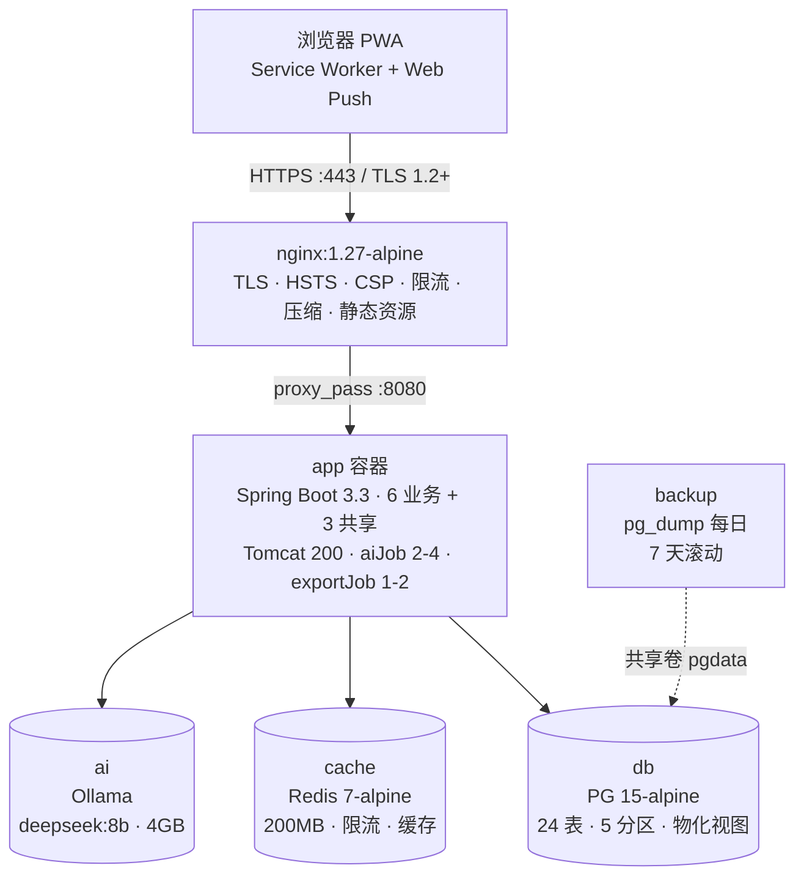

# Lifewise 技术架构设计

> **文档代号**：`technical-architecture`
> **版本**：v1.0
> **状态**：Approved Design
> **设计日期**：2026-07-25
> **关联文档**：
> - [`business-architecture.md`](./business-architecture.md) — 业务模块、接口、事件、流程
> - [`data-model-design.md`](./data-model-design.md) — 24 张表、Outbox、分区、索引
> - [`../specs/PRD/01-task-management.md`](../specs/PRD/01-task-management.md) ~ [`06-ai-analysis.md`](../specs/PRD/06-ai-analysis.md) — 6 个产品 PRD
> **目标读者**：研发、运维、架构评审、AI 工程师
> **架构方法**：模块化单体 + Docker Compose 单机部署 + PWA 接入

---

## 0. 引言

### 0.1 文档目的

本文档定义 Lifewise MVP 的**物理拓扑、部署形式、可观测性、灾备与安全**等 PRD 与业务架构未明确的工程决策，回答"系统如何被部署、运行、监控和恢复"。

它**不重复**业务架构 doc 已锁定的内容（模块边界、接口契约、事件信封、流程图），也不重复数据模型 doc 已锁定的内容（表结构、索引、BR、Flyway 迁移），仅在涉及技术落地时引用。

### 0.2 关键决策摘要

| 决策项 | 方案 | 决策依据 |
|---|---|---|
| 客户端形态 | 响应式 Web PWA | 浏览器 + Service Worker，离线缓存 + Web Push |
| 部署形态 | **本地 Docker Compose 单机部署** | 个人版，多用户为未来演进 |
| 规模 | 单机个人版 | 万级用户容量在 1 容器内 |
| 认证 | 邮箱密码 + JWT + Refresh Token | 自主可控，可扩展 OAuth |
| 业务后端 | Spring Boot 3 模块化单体（6 业务模块 + 3 共享） | 业务架构 §4 锁定 |
| 数据层 | PostgreSQL 15 + Redis 7 + Ollama 本地 | 数据模型 §0 锁定 |
| LLM 推理 | 本地 Ollama（deepseek:8b） | PRD AI 隐私约束 |
| 任务编排 | Docker Compose | 单机，无 K8s 需求 |
| 监控 | Actuator + Prometheus 端点 + 结构化日志 | 个人版轻量方案 |
| 灾备 | 每日 `pg_dump` + 7 天滚动 + 宿主机副本 | RPO 24h / RTO < 30min |

### 0.3 范围与读者

- **MVP 范围**：6 业务模块、24 张表、5 个核心容器
- **非 MVP**：跨模块洞察（v1.1）、多模态（v1.2）、协作（v1.3）、多区域/多活
- **演进路径**：业务架构 §10 已规划，本文档不重复

---

## 1. 架构总览

### 1.1 顶层架构图



### 1.2 容器清单（5 核心 + 1 可选）

| 容器 | 镜像 | 端口 | 资源上限 | 数据卷 | 职责 |
|---|---|---|---|---|---|
| `nginx` | `nginx:1.27-alpine` | 443 → 80 | 256MB / 0.5 CPU | `./nginx/conf`, `./nginx/certs` | TLS 终止、HSTS、CSP、静态资源、压缩、SSE keepalive |
| `app` | 自建 `eclipse-temurin:21-jre` | 8080 | 2GB / 2 CPU | `./app/config`, `./app/logs` | Spring Boot 3 模块化单体；HTTP/SSE + OutboxWorker + 9 个日终 Job |
| `db` | `postgres:15-alpine` | 5432 (内网) | 1GB / 1 CPU | `pgdata` (命名卷) | 24 张业务表 + Outbox + 物化视图 |
| `cache` | `redis:7-alpine` | 6379 (内网) | 256MB / 0.5 CPU | `redisdata` (命名卷) | 限流、幂等键、缓存、Web Push 状态 |
| `ai` | `ollama/ollama:latest` | 11434 (内网) | 4GB / 2 CPU | `ollamadata` (命名卷) | deepseek:8b 模型；单用户串行 |
| `backup` | `prodrigestivill/postgres-backup-local` | — | 128MB / 0.2 CPU | `pgbackups` (命名卷) | 每日 03:00 `pg_dump` + 滚动 7 天 |

### 1.3 容器间网络

```yaml
networks:
  internal:
    driver: bridge
    internal: true      # 关键：禁止访问外网
  edge:
    driver: bridge
```

| 容器 | internal | edge | 备注 |
|---|---|---|---|
| `nginx` | ✓ | ✓ | 唯一对外暴露 443 |
| `app` | ✓ | — | 仅 nginx → app |
| `db` | ✓ | — | 仅 app → db |
| `cache` | ✓ | — | 仅 app → cache |
| `ai` | ✓ | — | 仅 app → ai |
| `backup` | ✓ | — | 通过共享卷访问 pgdata |

### 1.4 app 容器内进程模型

```
┌──────────────── app 容器 (Spring Boot 3) ────────────────┐
│  Tomcat 线程池（默认 200）                               │
│    ├─ HTTP 控制器（6 业务模块 + 3 共享）                │
│    ├─ SSE 控制器（AI 流 / 报表进度）                     │
│    └─ Web Push 触发器（VAPID）                          │
│  @Scheduled 线程池                                       │
│    ├─ OutboxWorker（每 1s 拉一批）                       │
│    ├─ EnsurePartitionJob（每日 02:00）                   │
│    ├─ BudgetEvaluatorJob（每小时）                       │
│    ├─ HabitMissedJob（每日 21:00）                       │
│    ├─ MilestoneMissedJob（每日 09:00）                   │
│    ├─ PlanStaleNotifyJob（每日 10:00）                   │
│    ├─ RefreshMaterializedViewJob（每日 03:30）           │
│    ├─ PurgeSoftDeletedJob（每日 03:00）                  │
│    └─ PurgeChatMessagesJob（每日 03:30，DROP 旧分区）     │
│  异步任务执行器（隔离线程池）                           │
│    ├─ aiJobExecutor（2/4 线程，50 队列）                │
│    └─ exportJobExecutor（1/2 线程，10 队列）             │
└──────────────────────────────────────────────────────────┘
```

---

## 2. 接入层（Nginx + PWA + TLS）

### 2.1 PWA 离线策略

| 资源类型 | 缓存策略 | 备注 |
|---|---|---|
| App Shell（HTML/JS/CSS） | `CacheFirst` + 版本号触发失效 | 部署时新 `sw.js` 主动清旧 cache |
| 静态资源（图片、字体） | `CacheFirst` + 长 TTL | 配合 Nginx immutable 头 |
| 读请求（GET /api/...） | `NetworkFirst` + 失败回退 cache | 让用户能查询最近缓存 |
| 写请求（POST/PUT/DELETE） | 不缓存，断网时进 IDB 队列 | 恢复后 Background Sync 重试 |
| SSE 长连接 | 不缓存，断线由前端 EventSource 自动重连 | `lastEventId` 续传 |

### 2.2 Nginx 配置要点

| 维度 | 配置 |
|---|---|
| **TLS 终止** | 证书：个人版用自签或受信任 CA pre-import；协议：TLSv1.2+；套件：Mozilla Intermediate；HSTS：`max-age=31536000; includeSubDomains` |
| **安全响应头** | CSP: `default-src 'self'; img-src 'self' data:; connect-src 'self'`；X-Frame-Options: DENY；X-Content-Type-Options: nosniff；Referrer-Policy: strict-origin-when-cross-origin；Permissions-Policy: 关闭不必要 API |
| **路由** | `/` 与 `/assets/*` 直出静态资源；`/api/*` → app:8080；`/api/ai/reports/{id}/stream` SSE（关闭缓冲/压缩）；`/actuator/*` 仅 127.0.0.1 |
| **限流（limit_req）** | `/api/ai/*` 100 req/min/IP；`/api/auth/*` 10 req/min/IP（防爆破）；`/api/export/*` 5 req/min/IP；超出 429 + Retry-After |
| **压缩** | Brotli 优先 / gzip 兜底；不压缩 SSE |
| **缓存** | `/assets/`: immutable, 1y；`/`: no-cache, must-revalidate；`/api/*`: no-store；Service Worker 自身: no-cache |

### 2.3 Web Push 通道

- VAPID 公钥在登录后下发，私钥只存服务端环境变量
- 推送投递：服务端 → 浏览器（不经 Nginx SMTP）
- 浏览器订阅存储于 `push_subscriptions` 表（数据模型 §3.1.3）

### 2.4 与 SaaS 架构的差异化

| 能力 | SaaS 版本 | 本架构（个人版） |
|---|---|---|
| 证书 | Let's Encrypt + 自动续签 | 自签或本地 CA pre-import |
| CDN | 边缘节点 | 无 |
| 多区域 | 多活 | 单机 |
| API 网关 | Kong / Spring Cloud Gateway | Nginx 直接反代 |
| WAF | 云 WAF | Nginx limit_req |

---

## 3. 业务层（Spring Boot 3 模块化单体）

### 3.1 包结构与模块边界

```
com.lifewise
├── LifewiseApplication.java           # 主启动（JDK 21 + Spring Boot 3.3+）
│
├── app/                               # 应用装配
│   ├── config/                        # @Configuration 类
│   ├── web/                           # MVC 基础（拦截器、过滤器）
│   └── startup/                       # 启动后初始化（首启种子）
│
├── shared/                            # 横切关注点
│   ├── security/                      # JWT、密码、Spring Security Filter
│   ├── web/                           # 全局异常、API 信封、分页 DTO
│   ├── outbox/                        # Outbox 写入、事件信封、进程内发布
│   ├── idempotency/                   # 幂等键（idempotencyKey）
│   ├── ratelimit/                     # Redis Token Bucket 注解与切面
│   ├── observability/                 # Micrometer、Log MDC、审计
│   └── time/                          # 时区辅助（自然日计算）
│
├── user/                              # 用户与偏好（共享 1）
├── task/                              # 任务与习惯（业务 1）
├── plan/                              # 计划（业务 2）
├── dailyreport/                       # 日报（业务 3）
├── expense/                           # 消费与预算（业务 4）
├── meal/                              # 饮食与营养（业务 5）
├── ai/                                # AI 洞察（业务 6）
├── notify/                            # 通知与提醒（共享 2）
└── export/                            # 导出与数据携带（共享 3）
```

### 3.2 跨模块调用规则

- 任何 `xxx.port.in` 接口只返回 `record` DTO + 领域 ID，**绝不暴露实体或 Repository**
- 反向：业务模块不依赖 `web` 包，`adapter/web` 调用 `application` 层
- 跨模块副作用通过 Outbox 事件，不直接修改对方聚合
- 违反规则靠 ArchUnit 测试在 CI 失败：`com.lifewise.task.adapter.persistence` 不能被 `com.lifewise.plan.*` 引用

### 3.3 Web 路由设计

| 路径前缀 | 模块 | 关键端点 |
|---|---|---|
| `/api/v1/auth/*` | user | `POST /login`、`POST /refresh`、`POST /logout` |
| `/api/v1/users/me` | user | `GET/PATCH` |
| `/api/v1/tasks` | task | `POST/GET/PATCH/DELETE` + 看板 `/board` |
| `/api/v1/habits` | task | `POST/GET/check-in/backfill` |
| `/api/v1/plans` | plan | `POST/GET/PATCH/DELETE` + 里程碑 |
| `/api/v1/daily-reports` | dailyreport | `POST/GET/PATCH/DELETE` + `/timeline` |
| `/api/v1/expenses` | expense | `POST/GET/PATCH/DELETE` + `/categories` + `/budgets` |
| `/api/v1/meals` | meal | `POST/GET/PATCH/DELETE` + `/foods` + `/nutrition` |
| `/api/v1/ai/reports` | ai | `POST`、`GET /{jobId}`、`GET /{jobId}/stream` (SSE)、`GET /` |
| `/api/v1/ai/chat` | ai | `POST`（规则路径 + LLM 路径） |
| `/api/v1/exports` | export | `POST`、`GET /{id}`、`GET /{id}/download` |
| `/api/v1/notify/subscriptions` | notify | `POST /webpush`、`DELETE` |
| `/actuator/*` | 运维 | `health`（综合）/ `info` / `metrics`（仅 127.0.0.1） |

### 3.4 鉴权链（Spring Security）

```
SecurityFilterChain
  └─ CORS Filter
  └─ CSRF（仅 cookie 会话路径启用；JWT 路径禁用）
  └─ RequestSizeLimit（10MB）
  └─ JwtAuthenticationFilter（解析 Bearer + 注入 SecurityContext）
  └─ SecurityContextHolderFilter
  └─ AuthorizationFilter（@PreAuthorize 校验角色）
  └─ Controller
```

| 路径 | 鉴权要求 |
|---|---|
| `/api/v1/auth/login` | 公开；IP 限流 10/min |
| `/api/v1/auth/refresh` | 仅 Refresh Cookie |
| `/api/v1/notify/subscriptions` | 已登录 |
| `/api/v1/ai/*` | 已登录 + `ai_interpretation_enabled=true`（业务架构 §6.6 红色态降级） |
| `/api/v1/exports/*/download` | 已登录 + 校验 export.userId == SecurityContext.userId |
| `/actuator/health` | 仅 127.0.0.1 |
| `/actuator/metrics` | 仅 127.0.0.1 |

### 3.5 限流实现

- 注解 `@RateLimit(scope="ai", key="userid", window="1m", limit=10)`
- 切面读取注解 → Redis `INCR + EXPIRE` 或 Lua 脚本 Token Bucket
- 超限返回 `RATE_LIMITED` 稳定错误码 + `Retry-After` 头
- **关键路由硬限**：
  - AI 全部端点：10 req/min/user、60 req/h/user、100 req/min 全局（业务架构 §5.2 AI-043）
  - 登录与刷新：10 req/min/IP
  - 导出：5 req/min/user
  - Web Push 订阅：20 req/min/user

### 3.6 错误处理

```java
// 稳定错误码
public enum ErrorCode {
    INVALID_INPUT,           // 400
    NOT_FOUND,               // 404
    CROSS_USER_ACCESS,       // 404（与不存在统一返回，防枚举）
    VERSION_CONFLICT,        // 409
    RATE_LIMITED,            // 429
    AI_UNAVAILABLE,          // 503（LLM 不可用）
    PUSH_DELIVERED_INAPP,    // 200（Push 失败降级）
    INTERNAL_ERROR           // 500
}

// 全局响应信封
{
  "code": "VERSION_CONFLICT",
  "message": "日报已在新设备更新，请合并",
  "data": { "serverVersion": {...}, "clientVersion": {...} },
  "traceId": "..."
}
```

### 3.7 异步任务执行器（隔离线程池）

| 线程池 | 核心/最大 | 队列 | 阻塞影响 |
|---|---|---|---|
| `httpWorker`（Tomcat） | 200/200 | — | 阻塞 = 拒绝新请求 |
| `aiJobExecutor` | 2/4 | 50 | 阻塞 = AI 端点排队；HTTP 不阻塞 |
| `exportJobExecutor` | 1/2 | 10 | 阻塞 = 导出请求排队 |
| `outboxWorker`（@Scheduled） | 1/1 | — | 阻塞 = 事件延迟，但业务事务已提交 |
| `scheduledJobs` | 4/4 | — | 日终 Job 互相隔离 |

### 3.8 健康检查（`/actuator/health` 自定义）

```yaml
health:
  db:        # 已就绪 + 写入测试 + 可用连接数
  redis:     # PING + 内存使用
  ollama:    # GET /api/tags 200 + 30s 内响应
  disk:      # /var/lib/postgresql/data 剩余 > 5GB
  outbox:    # 滞后行数 < 1000（连续 2 次失败告警）
  partitions:# 未来 30 天分区覆盖
```

### 3.9 配置 Profile

| Profile | 用途 | 关键差异 |
|---|---|---|
| `local` | 开发者本机 | 启用 SQL log、关闭 VAPID、dev 模式 |
| `compose` | 个人版 Docker Compose | 容器内网地址、Ollama `ai:11434` |
| `prod`（预留） | 未来多机 | 全部走环境变量、禁用 Actuator 暴露 |

### 3.10 时区策略

- 所有容器挂载 `/etc/localtime:/etc/localtime:ro` 与 `TZ` 环境变量
- DB 端的 `users.timezone` 是业务时区（PRD §8 风险要求），与容器时区无关
- 日志、`updated_at` 默认 NOW() 使用容器/DB UTC

### 3.11 启动顺序

```
1. Spring 启动 →  Flyway migrate（V1~V20）
2. EnsurePartitionJob 立即跑一次（兜底，防止冷启动后 30 天无人触发）
3. AI 模块注入 Ollama URL → 触发首次健康探测
4. Actuator /health/readiness 返回 UP → Nginx upstream 标记就绪
```

---

## 4. 数据层（PG 15 + Redis 7 + Ollama + 卷挂载）

### 4.1 数据卷总览

| 卷名 | 容器 | 用途 | 容量预估 |
|---|---|---|---|
| `pgdata` | db | PG 15 数据目录 | ~5GB/年 |
| `redisdata` | cache | Redis AOF/RDB | < 200MB |
| `ollamadata` | ai | deepseek:8b 模型 | ~5GB |
| `pgbackups` | backup | pg_dump 文件 | 7 天滚动 |
| `nginx_logs` | nginx | 访问 + 错误日志 | ~500MB/年 |
| `app_logs` | app | Spring Boot 日志 | ~1GB/年 |

### 4.2 PostgreSQL 15 容器

```yaml
db:
  image: postgres:15-alpine
  deploy:
    resources: { limits: { memory: 1G, cpus: '1.0' } }
  command:
    - "postgres"
    - "-c" "shared_buffers=256MB"
    - "-c" "work_mem=16MB"
    - "-c" "effective_cache_size=768MB"
    - "-c" "max_connections=100"
    - "-c" "log_min_duration_statement=1000"
    - "-c" "log_lock_waits=on"
    - "-c" "autovacuum_analyze_scale_factor=0.05"
    - "-c" "timezone=UTC"
  environment:
    POSTGRES_DB: lifewise
    POSTGRES_USER: lifewise
    POSTGRES_INITDB_ARGS: "--encoding=UTF8 --lc-collate=en_US.UTF-8 --lc-ctype=en_US.UTF-8"
  volumes:
    - pgdata:/var/lib/postgresql/data
  healthcheck:
    test: ["CMD-SHELL", "pg_isready -U lifewise"]
    interval: 10s
    timeout: 3s
    retries: 5
```

**Flyway 迁移一致性**（与数据模型 §6 对齐）：

| 启动阶段 | 行为 |
|---|---|
| 首次启动 | Flyway 执行 V1 → V20（包含分区、物化视图、种子数据） |
| 升级启动 | Flyway 检测新版本，仅执行 `V{n+1}__*.sql` |
| 启动日志 | `flyway.info` 输出到 `app_logs`，便于审计 |
| 失败回滚 | 启动失败 → 容器退出 1 → Compose 重启策略告警 |

### 4.3 Redis 7 容器

```yaml
cache:
  image: redis:7-alpine
  deploy: { resources: { limits: { memory: 256M, cpus: '0.5' } } }
  command:
    - "redis-server"
    - "--maxmemory=200mb"
    - "--maxmemory-policy=allkeys-lru"
    - "--appendonly=yes"
    - "--appendfsync=everysec"
    - "--save=900 1"
    - "--lua-time-limit=5000"
  volumes: [redisdata:/data]
  healthcheck: { test: ["CMD", "redis-cli", "ping"], interval: 10s }
```

**Redis Key 空间分配**：

| Key 前缀 | 用途 | 数量上限 | TTL |
|---|---|---|---|
| `rl:ai:user:{userId}:m` | 每用户 AI 每分钟令牌 | 100（单用户不超） | 60s |
| `rl:ai:user:{userId}:h` | 每用户 AI 每小时令牌 | 60 | 3600s |
| `rl:ai:global:m` | 全局 AI 每分钟令牌 | 100 | 60s |
| `rl:auth:ip:{ip}` | 登录爆破限流 | — | 60s |
| `idem:{idemKey}` | 幂等键 → 响应体 | ~1w | 24h |
| `cache:expense:pie:{userId}:{yyyy_mm}` | 消费饼图缓存 | 12/月 | 6h |
| `cache:meal:weekly:{userId}:{weekStart}` | 周营养汇总缓存 | 1/周 | 6h |
| `cache:plan:progress:{userId}:{planId}` | 计划进度缓存 | ~10 | 30min |
| `backfill:{userId}:{habitId}:{date}` | 习惯补卡计数 | 1/日 | 1d |
| `pb:sub:{userId}:{endpointHash}` | Web Push 订阅 | 5/user | 永久 |

### 4.4 Ollama 容器

```yaml
ai:
  image: ollama/ollama:latest
  deploy: { resources: { limits: { memory: 4G, cpus: '2.0' } } }
  environment:
    OLLAMA_KEEP_ALIVE: "5m"             # 5 分钟无请求卸载模型
    OLLAMA_NUM_PARALLEL: "1"            # 单用户串行
    OLLAMA_MAX_LOADED_MODELS: "1"
  volumes: [ollamadata:/root/.ollama]
  healthcheck:
    test: ["CMD", "curl", "-f", "http://localhost:11434/api/tags"]
    interval: 30s
    timeout: 5s
    retries: 2
  entrypoint: ["/bin/sh", "-c"]
  command: >
    "ollama serve &
    until curl -sf http://localhost:11434/api/tags > /dev/null; do sleep 1; done
    ollama pull deepseek:8b || true
    wait"
```

**关键约束**：
- `OLLAMA_NUM_PARALLEL=1`：单用户单请求，确保 P95 < 30s 不被抢占
- `KEEP_ALIVE=5m`：空闲卸载，节省内存
- 启动时自动 `ollama pull deepseek:8b`（约 5GB）；如已存在则跳过
- `app` 容器通过 `internal:11434` 调用；不暴露端口到宿主机

### 4.5 backup 容器

```yaml
backup:
  image: prodrigestivill/postgres-backup-local
  environment:
    POSTGRES_HOST: db
    POSTGRES_DB: lifewise
    POSTGRES_USER: lifewise
    POSTGRES_PASSWORD: ${PG_PASSWORD}
    SCHEDULE: "@daily"
    BACKUP_KEEP_DAYS: "7"
    BACKUP_KEEP_MINS: "10080"
    BACKUP_COMPRESS: "gzip"
    BACKUP_FILE_SUFFIX: "lifewise"
    HEALTHCHECK_PORT: "8080"
  volumes: [pgbackups:/backups]
```

### 4.6 数据生命周期（与数据模型 §6.4 一致）

| Job | 触发 | SQL 操作 | 容器 |
|---|---|---|---|
| `EnsurePartitionJob` | 每日 02:00 | 预创建未来 90 天 PG 分区 | app |
| `PurgeSoftDeletedJob` | 每日 03:00 | 物理删 30 天前软删记录 | app |
| `BackupJob` | 每日 03:00 | `pg_dump` → 命名卷 | backup |
| `PurgeChatMessagesJob` | 每日 03:30 | DROP 30 天前 chat_messages 分区 | app |
| `RefreshMaterializedViewJob` | 每日 03:30 | `REFRESH MATERIALIZED VIEW CONCURRENTLY` | app |
| `TruncateOutboxOldJob` | 每日 04:00 | TRUNCATE 7 天前 outbox_events 分区 | app |
| `BackupCleanup` | 每日 04:30 | 清理 7 天前的 .gz 文件 | backup |

### 4.7 关键性能指标（与业务架构 §11 对齐）

| 能力 | 目标 | 落地 |
|---|---|---|
| 任务创建 P95 | ≤ 1.5s | 单域事务 + Redis 0 依赖 |
| 日报保存 P95 | ≤ 1.2s | 正文 + pg_trgm 索引 |
| 消费记录 P95 | ≤ 1.0s | cents 整数 + 物化视图 |
| 餐次记录 P95 | ≤ 1.5s | 营养快照单域内 |
| 计划创建 P95 | ≤ 2.0s | 计划本地事务 |
| 任务到里程碑 | < 5s | Outbox 进程内 |
| AI 首 token P95 | < 3s | Ollama keep_alive + 异步 |
| AI 端到端 P95 | < 30s | JobTimeout 30s 自动取消 |
| 消费饼图 P95 | ≤ 500ms | 物化视图 + Redis 缓存 |
| 历史归档查询 | < 1s | 按月分区 + 归档索引 |

### 4.8 数据一致性边界

- 用户命令在单一业务域内强一致事务
- 跨域通过 Outbox → 进程内发布器 → 异步消费
- 导入导出 / 统计失败不回滚源数据

---

## 5. 安全 / 监控 / 备份 / 部署

### 5.1 安全架构

| 维度 | 设计 |
|---|---|
| **① 认证** | Access Token = JWT (HS256)，15 分钟，存内存；Refresh Token = JWT (HS256)，30 天，HttpOnly + Secure + SameSite=Strict Cookie；密码 = bcrypt(cost=12)；登录失败 5 次锁 15 分钟（Redis 计数） |
| **② 授权** | 角色：USER / ADMIN（仅内置）；资源所有权：每个请求校验 `userId == SecurityContext.userId`；跨用户访问统一返回 404（防枚举）；AI 红色态仅能查结构化报告，不能创建 LLM 作业 |
| **③ 传输加密** | 浏览器 ↔ Nginx：TLS 1.2+ (Mozilla Intermediate)；容器间：internal 网络（无 TLS、明文但网络隔离） |
| **④ 存储加密** | 备份文件：gzip（用户可叠加 GPG）；密码：bcrypt 哈希；VAPID 私钥：环境变量；磁盘：依赖宿主机 FileVault / BitLocker |
| **⑤ 输入校验** | 边界层 Bean Validation (`@NotNull`/`@Pattern`/`@Size`)；SQL 注入：JPA 参数化 + Flyway 迁移管控；Markdown XSS：markdown-it + DOMPurify（前后端双重）；LLM SQL 注入：AST + 白名单 + SELECT-only + LIMIT |
| **⑥ 审计日志** | 记录：登录/登出、跨用户访问尝试、AI 操作、导出下载、限流超限、密码修改、Outbox 失败重试；字段：userId, action, resourceType, resourceId, ip, userAgent, result, errorCode, traceId；保留 180 天（轮转） |

### 5.2 监控与可观测性

| 维度 | 工具 | 关键指标 |
|---|---|---|
| **Metrics** | Micrometer + Prometheus 端点 `/actuator/prometheus` | JVM 内存/线程/GC、Tomcat 连接、DB 连接池、Redis Pool、HTTP 状态码分布、AI 队列长度、Outbox 滞后行数 |
| **Logs** | logback-spring.xml → JSON | MDC：`traceId, userId, spanId`；生产 INFO / 开发 DEBUG |
| **Tracing** | Micrometer Tracing + Brave | 注入 MDC；预留对接 Jaeger |
| **Health** | Spring Boot Actuator | 自定义检查：DB / Redis / Ollama / Disk / Outbox / Partition |
| **告警** | Webhook（用户自配） | Ollama 连续失败 ×2、Outbox 滞后 > 1k、磁盘剩余 < 5GB、备份缺失 > 24h |

> **个人版简化**：无 Prometheus/Grafana 部署；指标端点保留供用户选用。**日志 + 健康检查 + 手动审查** 是 MVP 主力。

### 5.3 备份与恢复

| 维度 | 策略 |
|---|---|
| **备份方式** | `pg_dump` 自定义格式（`-Fc`）+ gzip，每日 03:00 |
| **保留** | 7 天滚动（容器内） + 宿主机用户自托管（推荐 Time Machine / rclone 同步云端） |
| **关键卷** | `pgdata`（业务核心）、`pgbackups`（备份）、`ollamadata`（可重 pull）、`nginx_logs` / `app_logs`（可重建） |
| **RPO** | 24 小时 |
| **RTO** | < 30 分钟（重建容器 + 恢复 dump） |
| **恢复流程** | `docker compose down → docker volume rm pgdata → docker compose up -d → pg_restore -d lifewise /backups/latest.dump` |
| **升级前自动备份** | Compose `pre-up` hook 触发 `pg_dump` 到 `pgbackups` 额外标签 |

### 5.4 部署与升级

```bash
# 首次部署
git clone <repo>
cd lifewise
./setup.sh                 # 生成自签证书、生成 JWT/VAPID/PG 密钥、写入 .env
docker compose up -d
# 浏览器访问 https://localhost/，首次注册管理员

# 升级
git pull
docker compose pull
docker compose up -d
# Flyway 自动迁移，数据卷不变

# 仅回滚应用（不回滚 DB）
docker compose up -d --force-recreate --no-deps app

# 查看日志
docker compose logs -f app
docker compose logs -f nginx
```

**密钥管理**：

| 密钥 | 存放 | 轮换策略 |
|---|---|---|
| `PG_PASSWORD` | `.env` | 季度（手动） |
| `JWT_SECRET` | `.env` | 月度（手动） |
| `VAPID_PRIVATE_KEY` | `.env` | 一次性 |
| `REDIS_PASSWORD` | `.env` | 季度（手动） |

`.env` 加入 `.gitignore`；提供 `.env.example` 模板。

---

## 6. 综合分析

### 6.1 一致性矩阵（PRD × 业务架构 × 数据模型）

| PRD 模块 | 业务架构覆盖 | 数据模型覆盖 | 状态 |
|---|---|---|---|
| 01 任务管理 | §4.1 / §6.1 / §6.2 / §6.8 | 5 表（tasks/habits/logs/tags/links）+ 30 条 BR | ✅ 完全对齐 |
| 02 日报 | §4.1 / §6.5 | 3 表（按月分区）+ tsvector 索引 | ✅ 完全对齐 |
| 03 消费追踪 | §4.1 / §6.3 / §6.8 | 5 表（categories/按月 expenses/budgets）+ 物化视图 | ✅ 完全对齐 |
| 04 饮食记录 | §4.1 / §6.4 | 4 表（foods/按月 meals/items）+ pg_trgm 索引 | ✅ 完全对齐 |
| 05 计划管理 | §4.1 / §6.1 / §6.8 | 3 表 + `last_activity_at`（H-4） | ✅ 完全对齐 |
| 06 AI 分析 | §4.1 / §6.6 / §6.7 | 4 表（含 attempts/限流）+ `user_profiles.ai_*` | ✅ 完全对齐 |

**结论**：PRD 全部 6 模块、约 80+ 功能点均被业务架构与数据模型覆盖；2 份架构文档零冲突。

### 6.2 关键不一致 / 风险点（已修复）

| 编号 | 冲突/风险 | 出处 | 现状 |
|---|---|---|---|
| R-1 | 习惯补卡窗口：`PRD-01:83`（3 天）vs `PRD-01:230`（更早） | 业务架构 §9 裁决 | ✅ 已统一为 `[today-3, today)` |
| R-2 | 日报 AI 摘要：MVP（手动）vs v1.1（自动 22:00） | 业务架构 §9 + PRD-02 §6 | ✅ 明确 MVP 仅手动 |
| R-3 | PRD 提"22 张表" vs 实际 24 张 | 数据模型 v1.1.1 修订 | ✅ 已含 user_profiles + users |
| R-4 | PRD AI-042 重试 3 次 vs 早期文档未约束 | 数据模型 BR-28 + ai_jobs.max_attempts | ✅ 已落地 |
| R-5 | 预算提醒"每月最多一次" vs "80% + 100% 各一次" | 业务架构 §9 裁决 | ✅ 已统一 |
| R-6 | AI SQL 范围：直接白名单源表 vs 发布视图 | 业务架构 §9 裁决 | ✅ 仅允许版本化发布视图 |
| R-7 | 关键词云 / 看板 / 模板：MVP 清单 vs v1.1 决策 | 业务架构 §9 + 各 PRD §6 | ✅ 均排除 |
| R-8 | `daily_reports` 分区按年 vs 按月 | 数据模型 v1.1 H-1 | ✅ 已改为按月 |
| R-9 | `meals` 未分区 vs 需按月分区 | 数据模型 v1.1 H-2 | ✅ 已加按月 |
| R-10 | 「其他」分类语义模糊 | 数据模型 v1.1 M-5 / BR-24 | ✅ 明确为每用户预置 |

**结论**：所有已识别冲突均已在 v1.1 修订和业务架构裁决中修复。

### 6.3 完整性缺口

#### 6.3.1 设计空白（被本技术架构方案填补）

| 缺口 | 描述 | 落地位置 |
|---|---|---|
| 认证/授权 | PRD 6 份引用"账号体系"但未设计 | §5.1（JWT + Refresh） |
| 客户端形态 | PRD 提"移动端 1.5s"、Web Push，无 PWA 决策 | §2.1（PWA + Service Worker） |
| 部署形态 | PRD 完全不提 | §5.4（Docker Compose 单机） |
| 监控/告警 | PRD 不提 | §5.2（Actuator + Webhook） |
| 灾备 | PRD 不提 | §5.3（pg_dump 7 天） |
| 数据离线 | PWA 涉及离线草稿，PRD 提"自动保存 5s"但无离线 | §2.1（IndexedDB + Background Sync） |
| 审计日志 | 业务架构隐含但无具体规范 | §5.1（统一字段） |

#### 6.3.2 仍建议补充的专门设计文档

| 缺口 | 优先级 | 建议 |
|---|---|---|
| 用户认证与权限设计 | 高 | 单独 doc：登录、注册、密码找回、角色矩阵、双因素预留 |
| Prompt 模板与 AI 上下文管理 | 高 | 单独 doc：6 个 prompt 模板、ContextBuilder 设计、Token 预算 |
| 前端架构设计 | 中 | 单独 doc：组件库选择、状态管理、路由、PWA 离线策略、Markdown 渲染 |
| CI/CD 与开发流程 | 中 | 单独 doc：本地开发、CI、镜像构建、发布 |
| 运维手册 | 低 | 部署、升级、备份恢复、故障排查 |

### 6.4 可执行性评估

#### 6.4.1 工作量化（粗估）

| 模块 | 后端工时 | 前端工时 | AI/数据 | 风险 |
|---|---|---|---|---|
| 任务管理 | 5 人天 | 5 人天 | — | 低 |
| 日报 | 4 人天 | 6 人天 | Markdown 渲染 1 人天 | 中 |
| 消费追踪 | 5 人天 | 5 人天 | 物化视图 1 人天 | 低 |
| 饮食记录 | 5 人天 | 5 人天 | pg_trgm 1 人天 | 低 |
| 计划管理 | 4 人天 | 4 人天 | — | 低 |
| AI 分析 | 8 人天 | 4 人天 | Ollama 集成 3 人天 | 高 |
| 用户/认证 | 3 人天 | 3 人天 | — | 低 |
| 通知/导出 | 4 人天 | 3 人天 | — | 中 |
| 基础设施 | 10 人天 | 3 人天 | Docker Compose / CI | 中 |
| **合计** | **~48 人天** | **~38 人天** | **~6 人天** | — |

PRD 提"Phase 1 4-6 周"——单人全栈约 14 周，双人（前端+后端）约 6-8 周。**Phase 1 4-6 周**仅在 3 人团队（后端+前端+AI）或已有 SSO 时可达成。

#### 6.4.2 已识别高风险点

| 风险 | 影响 | 缓解 |
|---|---|---|
| LLM 输出质量不稳定 | AI 解读不可控 | Prompt 强约束 + 输出正则 + 用户可重生成（业务架构 §6.6） |
| Outbox 投递延迟 | 任务完成到里程碑更新 > 5s | OutboxWorker 1s 轮询 + 监控告警 |
| Markdown XSS | 数据泄露 | 双重清洗（前端 DOMPurify + 后端 markdown-it） |
| Web Push iOS 兼容性 | 提醒到达率低 | 应用内通知降级（业务架构 §6.8） |
| Ollama 资源占用 | 内存峰值 4GB | NUM_PARALLEL=1 + KEEP_ALIVE=5m |
| 数据丢失（RPO 24h） | 重大事故 | 7 天滚动 + 用户宿主机备份 |

### 6.5 架构质量自检（业务架构 §12 对照）

| 验收项 | 落地位置 | 状态 |
|---|---|---|
| 模块能回答"做什么/拥有什么/不做什么" | 业务架构 §4.1 | ✅ |
| 跨模块流程有同步/异步边界 | 业务架构 §5.2 / §6.x | ✅ |
| 没有模块直接修改其他模块数据 | 业务架构 §2.2 + ArchUnit 强制 | ✅ |
| 重复命令/事件不产生重复 | 业务架构 §7 + 幂等键 + eventId | ✅ |
| AI 只访问版本化只读视图 | 业务架构 §6.7 + 业务架构 §9 | ✅ |
| Ollama/Push/导出故障不影响核心记录 | 业务架构 §2.1 原则 6 + §7 | ✅ |
| MVP 与 v1.1+ 无混用 | 业务架构 §10 | ✅ |
| 性能指标全部可落地 | 业务架构 §11 + 数据模型 §0 | ✅ |

**结论**：架构设计完整、无明显内部矛盾、可执行。

---

## 7. 验收与追踪

### 7.1 质量属性验收清单

| 能力 | 目标 | 架构措施 | 验证方式 |
|---|---|---|---|
| 任务创建 P95 | ≤ 1.5s | 单域事务、最小必填字段、通知异步化 | 压测 (`wrk`) |
| 日报保存 P95 | ≤ 1.2s | 正文与 AI 解耦、乐观并发、本地草稿 | 压测 |
| 消费记录 P95 | ≤ 1.0s | cents 存储、统计/通知不阻塞主事务 | 压测 |
| 餐次记录 P95 | ≤ 1.5s | 营养快照在单域内计算 | 压测 |
| 计划创建 P95 | ≤ 2.0s | 计划本地事务；任务联动异步 | 压测 |
| 任务到里程碑联动 | < 5s | Outbox、事件消费监控和重试 | 集成测试 |
| AI 首 token P95 | < 3s | 作业异步化、SSE、健康检查 | Ollama 监控 |
| AI 端到端 P95 | < 30s | 超时取消，结构化报告先完成 | JobTimeout 测试 |
| 规则问答 P95 | < 500ms | 规则优先、预定义参数化查询 | 延迟测试 |
| AI 可用性 | ≥ 95% | 健康检查；纯数据/规则路径降级 | uptime 监控 |
| Push 送达 | 目标 ≥ 90% | 渠道结果记录、重试和应用内降级 | 送达率统计 |
| 导出成功率 | 目标 ≥ 99% | 分页游标、作业重试、产物状态机 | 成功率统计 |
| 统计页读取 | P95 ≤ 500ms | 物化视图 + Redis 缓存 | 延迟测试 |
| 历史归档查询 | < 1s | 按月分区表 + 归档索引 | SQL 验证 |

### 7.2 需求追踪矩阵

| 来源 PRD | 对应模块 | 主要接口/事件 | 核心流程 |
|---|---|---|---|
| PRD-01 任务管理 | 任务与习惯、通知 | `SearchTaskReferences`、`TaskCompleted.v1`、`NotificationRequested.v1` | 流程 1、2、8 |
| PRD-02 日报 | 日报、AI、（任务 AI 上下文）、导出 | `CreateAnalysisJob`、`StreamAnalysis`、`GetAnalysisSnapshot(task)`、`GetExportDataset` | 流程 5、6、9 |
| PRD-03 消费追踪 | 消费与预算、通知、导出 | `NotificationRequested.v1`、`GetAnalysisSnapshot`、`GetExportDataset` | 流程 3、8、9 |
| PRD-04 饮食记录 | 饮食与营养、导出、AI | `GetAnalysisSnapshot`、`GetExportDataset` | 流程 4、6、9 |
| PRD-05 计划管理 | 计划、任务、通知 | `SearchTaskReferences`、`ValidateTaskReference`、`TaskCompleted.v1` | 流程 1、8 |
| PRD-06 AI 分析 | AI 洞察、五个源域 | `GetAnalysisSnapshot`、`ExecuteSafeDataQuery`、`StreamAnalysis` | 流程 6、7 |

### 7.3 演进路径（与业务架构 §10 保持一致）

| 阶段 | 关键变更 | 触发条件 |
|---|---|---|
| MVP（当前） | 模块化单体 + Docker Compose 5 容器 | — |
| v1.1 | SourceDataChanged → 分析投影；跨模块洞察；自动周/月报 | 日活稳定 ≥ 30 天 |
| v1.2 | 多模态输入（图片/语音/OCR/条形码） | 业务诉求 |
| v1.3 | 共享协作；AI "问答 + 操作" | 用户量增长 |
| 多机/多用户 | K8s 化；读写分离；多区域 | DAU > 10 万 |

---

## 8. 修订记录

| 版本 | 日期 | 主要变更 |
|---|---|---|
| v1.0 | 2026-07-25 | 初版：5 容器技术架构 + 跨文档综合分析 + 验收追踪 |

---

*文档版本：v1.0 — Approved Design*
*生成日期：2026-07-25*
*维护者：架构组*
